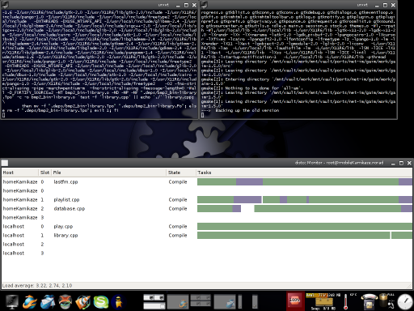

Distcc
======

.. |date| date::

.. sidebar:: Info

  .. image:: ../images/logo-freebsd.png
  .. image:: ../images/logo-openbsd.png
  .. image:: ../images/logo-netbsd.png
  .. image:: ../images/logo-dragonflybsd.png

Das Programm distcc wird dazu verwendet, die Rechenlast beim Kompilieren
von C und C++ Programmen auf mehrere Rechner in einem Netz zu verteilen.

Einleitung
----------

|Distcc in einem 2 Rechner Netz beim Bauen eines FreeBSD Ports.| Die
Software besteht aus einer
`Client <https://de.wikipedia.org/wiki/Client>`__- und einer
`Server <https://de.wikipedia.org/wiki/Server>`__-Komponente. Die Server
Komponente ist ein `Daemon <https://de.wikipedia.org/wiki/Daemon>`__,
der im Hintergrund auf Arbeit wartet. Da es bis auf IP-Adressen
keinerlei Authentifizierung gibt, sollte der Dienst nur in
vertrauenswürdigen Netzen oder über ein
`VPN <https://de.wikipedia.org/wiki/Virtual_Private_Network>`__
erreichbar sein.

Einrichtung
-----------

Zur Einrichtung ist außer der Installation auch das Anlegen einer Liste
erreichbarer Server bzw. das Einrichten des Daemon erforderlich.

Installation (FreeBSD)
~~~~~~~~~~~~~~~~~~~~~~

Der distcc findet sich in den FreeBSD Ports unter
`devel/distcc <https://www.google.com/search?q=devel/distcc&btnI=lucky>`__.

Installation (OpenBSD)
~~~~~~~~~~~~~~~~~~~~~~

Da sich der distcc nicht im offiziellen Ports-Tree befindet, muss er
hier entweder per Hand oder durch den `inoffiziellen
Port <http://www.ajd.net.au/ports/>`__ installiert werden. Letzteres ist
der bevorzugte Weg (sauberer).

Client (FreeBSD)
~~~~~~~~~~~~~~~~

Um FreeBSD als Client einzusetzen, muss das Verzeichnis
/usr/local/etc/distcc angelegt werden. In das Verzeichnis gehört eine
Datei namens hosts, die einfach die Hostnamen oder IP-Adressen
errichbarer Server enthält.

::

   # mkdir -p /usr/local/etc/distcc
   # echo "localhost 10.0.0.11   otherHost" > /usr/local/etc/distcc/hosts

Die Adressen **10.0.0.1** und **otherHost** sind natürlich nur
Beispiele, die durch passende Einträge ersetzt werden müssen.

Als nächstes müssen die Variablen CC und CXX in der Datei /etc/make.conf
entsprechend gesetzt werden.

::

   CC= /usr/local/bin/distcc cc
   CXX=    /usr/local/bin/distcc c++

Die absolute Pfadangabe ist wichtig für den Bau von Welt und Kernel.

Um von der Verwendung des distcc zu profitieren, muss
`make <https://de.wikipedia.org/wiki/make>`__ mit dem Parameter '-j N'
gestartet werden, wobei N für die Zahl der parallel laufenden Jobs
steht. Die distcc Dokumentation empfielt als Wert die Zahl der CPUs
(oder Kerne) multipliziert mit 2. Wenn ein Rechner nur wenig
Arbeitsspeicher hat, kann es aber auch Sinn machen, nur die Zahl der
möglichen CPUs zu verwenden.

Die Verwendung mit den FreeBSD Ports ist kompliziert, da '-j' nicht
unterstützt wird. Diese Einschränkung kann man weitestgehend mit
`buildflags <Bsdadminscripts#buildflags>`__ umgehen, das es erlaubt, die
Verwendung des distcc für einzelne Ports zu aktivieren oder zu
unterbinden.

Beim Bau von Welt oder Kernel entstehen keine Probleme.

Server (FreeBSD)
~~~~~~~~~~~~~~~~

Um den distcc Daemon zu verwenden, muss distccd_flags in der
/etc/rc.conf gesetzt werden, da der Daemon sonst aus Sicherheitsgründen
nur auf Anfragen von localhost wartet. Um den Daemon automatisch beim
Booten zu starten, muss außerdem distccd_enable auf 'YES' gesetzt
werden.

::

   distccd_enable="YES"
   distccd_flags="-a 127.0.0.0/8 --listen 127.0.0.1 -a 192.168.0.0/16 --listen 192.168.1.12 --user distcc --daemon -P /var/run/distccd.pid"

Im Beispiel hört der Daemon auf Anfragen an localhost (127.0.0.1) und an
der IP 192.168.1.12. Aufträge werden von allen Rechnern, deren IP mit
127 oder 192.168 beginnt, angenommen.

Um den distcc Daemon ohne Neustart zu starten, kann der Befehl

::

   # /usr/local/etc/rc.d/distccd start

verwendet werden. Wer auf den automatischen Start beim Booten verzichten
will und deshalb distccd_enable nicht setzt, kann den Daemon mit dem
Befehl

::

   # /usr/local/etc/rc.d/distccd onestart

aktivieren.

Zusammenarbeit zwischen i386 und amd64
--------------------------------------

Um Rechenzeit in einen Verbund aus einer i386/amd64 Mischung zu
verteilen müssen die Compiler erfahren für welche Architektur sie
compilieren sollen. Diese Information gehört in die CFLAGS der distcc
Clients.

Die folgenden Zeilen in der Datei ``/etc/make.conf`` unter FreeBSD
bewerkstelligen das für einen i386-Client.

::

   .if ${.CURDIR:M/usr/ports/*}
   CFLAGS+=  -m32
   .endif

Für einen amd64-Client heißt der Parameter schlicht **-m64**. Eine
Lösung zum Bauen von Welt und Kernel wurde vom Autor noch nicht
getestet.

Verweise
--------

-  http://distcc.samba.org die distcc Homepage.
-  `devel/distcc <https://www.google.com/search?q=devel/distcc&btnI=lucky>`__
   in den FreeBSD Ports.
-  `devel/distcc <https://www.google.com/search?q=devel/distcc&btnI=lucky>`__
   in Pkgsrc.

* :ref:`genindex`

Zuletzt geändert: |date|

