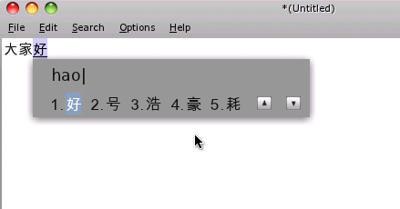
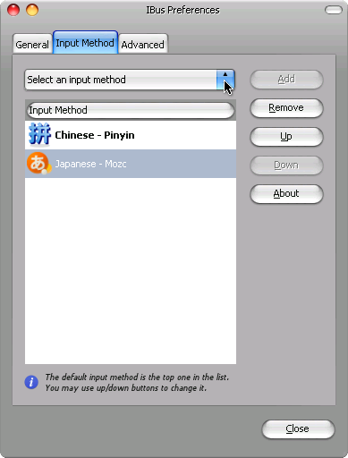

Chinesisch schreiben
====================

.. |date| date::

.. sidebar:: Info

  .. image:: ../images/logo-freebsd.png
  .. image:: ../images/logo-openbsd.png
  .. image:: ../images/logo-netbsd.png
  .. image:: ../images/logo-dragonflybsd.png

Um Chinesisch in FreeBSD schreiben zu koennen braucht man einen Input
Manager. Hier gibt es in den FreeBSD Ports gleich 3 davon

::

   chinese/ibus-pinyin
   chinese/fcitx
   chinese/scim-pinyin

Der beliebteste scheint wohl fcitx unter den Chinesen zu sein, leider
kann ich dort nicht von English auf Pinyin wechseln, von den anderen
beiden bevorzuge ich persoehnlich den ibus-pinyin.

ibus-pinyin und scim-pinyin sind ueber ein grafisches Menu
konfigurierbar, wobei fcitx nur eine Textdatei bietet, je nach
Systemeinstellung auf chinesisch oder English.

Dieser Artikel beschaeftigt sich mit ibus/pinyin

Chinesische Zeichen eingeben
----------------------------

Vorschau
~~~~~~~~

Hier mal eine kleine Vorschau wie das ganze dann mit dem ibus-pinyin
aussieht

|image0|

Programme
~~~~~~~~~

::

   chinese/ibus-pinyin

Der Port wird den Input Manager Ibus (als dependency) und das Pinyin
toolkit installieren

Konfiguration
~~~~~~~~~~~~~

### In der .bashrc wird dann folgendes hinzugefuegt

::

   export GTK_IM_MODULE=ibus       # for GTK Environment
   export QT_IM_MODULE=ibus        # for KDE Environment
   export XMODIFIERS="@im=ibus"        # other X Environment

### Nach einem anderem Tutorial sollte man das allerdings so setzen:

::

   export GTK_IM_MODULE=xim
   export QT_IM_MODULE=xim
   export XMODIFIERS="@im=ibus"
   export GDK_NATIVE_WINDOWS=true

Fuer fcitx oder scim muss man die XMODIFIERS respektiv setzen

::

   export XMODIFIERS="@im=fcitx"
   ##   oder
   export XMODIFIERS="@im=scim"

Danach kann man in X seinen bevorzugten Input Manager starten und je
nach Konfiguration mit <ctrl><shift> oder <ctrl><space> oder <ctrl><alt>
das Pinyin overlay aufrufen

Fehlerteufel
~~~~~~~~~~~~

Die Input Method laesst sich nicht aender.

Manche Programme (wie net-im/qq) setzen Vorraus, dass die Systemumgebung
auf

::

   LANG=zh_CN.UTF-8

gesetzt ist und falls nicht, laesst sich nicht zwischen den Sprachen
wechseln.

Wenn man sein System aber weiterhin auf English haben moechte und
trotzdem chinesisch schreiben moechte, dann kann man das umgehen in den
man auf der shell (vor dem starten des Programms) einfach

::

   export LANG=zh_CN.UTF-8

eingibt oder man kann ein shell script schreiben welches in etwa so
aussieht

::

   #!/bin/sh
   export LANG=zh_CN.UTF-8
   <program_name>

Was man dann anstelle des Programms startet

Pinyin Tonemarks eingeben
-------------------------

Vorwort
~~~~~~~

Mandarin nutzt 4 Verschiedene Tone, als Beispiel hier "ma":

::

   Tone 1: mā
   Tone 2: má
   Tone 3: mǎ
   Tone 4: mà

Es ist hier wichtig zu wissen, welcher Ton welche nummer hat, da man
spaeter die Eingabe wie folgt macht: ma1, ma2, ma3 oder ma4 und dieses
wird dann wie oben umgewandelt

.. _programme-1:

Programme
~~~~~~~~~

::

   textproc/m17n-contrib/

Dieser Port enthaelt Benutzer Contributed Input Methods, nicht nur
chinesisch, sondern eine ganze Menge mehr

.. _konfiguration-1:

Konfiguration
~~~~~~~~~~~~~

Ibus Einstellungen aufrufen, zum beispiel ueber

::

   user> ibus-setup 

Und dann im 2. Reiter auf **Input Method** und **Select and Input
Method**

|image1|

dann auf Pinyin (m17n)

|image2|

Danach auf **add**

Links
-----

`Google Ibus Project <http://code.google.com/p/ibus/>`__ `No Input
Window <http://forums.pcbsd.org/showthread.php?t=13160>`__ `QQ
Problem <http://www.freebsdchina.org/forum/viewtopic.php?t=51639&highlight=ibus+pinyin&sid=efcbd0829e9854a817054240b749100c>`__

.. |image2| image:: images/step2.png

* :ref:`genindex`

Zuletzt geändert: |date|

