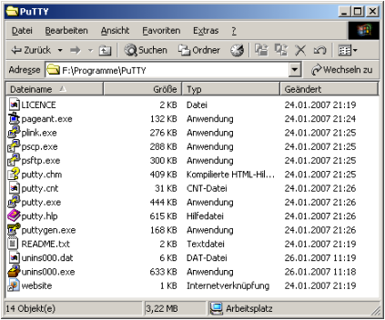
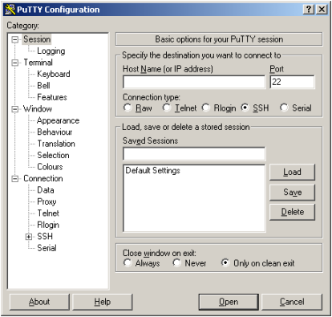
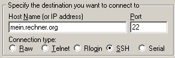
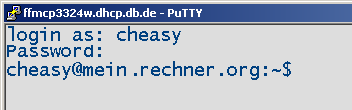
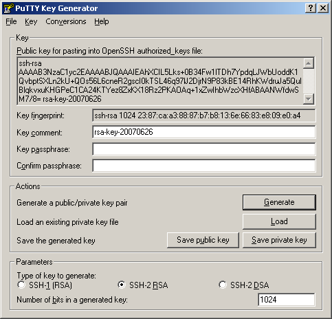

PuTTY
=====

.. |date| date::

.. sidebar:: Info

  .. image:: ../images/logo-freebsd.png
  .. image:: ../images/logo-openbsd.png
  .. image:: ../images/logo-netbsd.png
  .. image:: ../images/logo-dragonflybsd.png

Viele Unix-Administratoren arbeiten nicht vom Unix-Desktop, sondern
nutzen gewöhnliche Windows-Rechner als Konsole. Ein gängiger SSH-Client
für Windows (Win95 bis Vista) ist PuTTY, ein freier SSH-Client von Simon
Tatham. Dieser Artikel zeigt, wie man mit PuTTY verwendet, Verbindungen
mittels Zertifikaten authentifiziert, Tunnel aufbaut und Verbindungen
verwaltet.

PuTTY downloaden und installieren
---------------------------------

|PuTTY-Verzeichnis| Die Software findet man auf der `Homepage des Autors
Simon Tatham <http://www.chiark.greenend.org.uk/~sgtatham/putty/>`__ in
mehreren Versionen; eventuell ist die `Liste der
Mirrors <http://www.chiark.greenend.org.uk/~sgtatham/putty/mirrors.html>`__
hilfreich.

Die Installation muss unter Win32-Umgebungen mit Administratorrechten
ausgeführt werden; die Zip-Dateien können einfach in ein beliebiges
Verzeichnis ausgepackt werden. Im PuTTY-Verzeichnis findet man eine
ganze Reihe von Programmen:

======== ================== =================================================
Programm OpenSSH-Äquivalent Beschreibung
======== ================== =================================================
Pageant  ssh-agent          Keyring-Verwaltung, Einstellungen, User Interface
Plink    ssh                Kommandozeilen-Client, z.B. für Batch-Dateien
pscp     scp                Kommandozeilen-scp-Client
psftp    sftp               Kommandozeilen-sftp-Client
putty    ssh                Terminal-Emulator und ssh-Client mit GUI
puttygen ssh-genkey         Schlüsselgenerator
======== ================== =================================================

PuTTY einrichten
----------------

|New Connection| Beim ersten Start von PuTTY erscheint eine Dialogbox,
mit der man sich zu SSH-Servern verbinden kann. Am linken Rand des
Fensters findet man die Navigation durch die Einstllungs-Kategorien,
oben die Eingabefelder für Hostname und -Port, darunter gespeicherte
Verbindungen. Die erste dieser Verbindungen zeigt auf keinen bestimmten
Host, sondern speichert die Default-Einstellungen.

Terminal einrichten
~~~~~~~~~~~~~~~~~~~

Bevor man die erste Session öffnet, richtet man das Terminal ein. In der
Kategorie *Window* vergrößert man Bildschirmfläche z.B. auf 123 Zeichen
in 40 Zeilen und den Scrollback-Puffer. In *Window->Appearance* wählt
man einen Zeichensatz nach Geschmack. In *Window->Selection* kann man
die Funktion der mittleren und rechten Maustaste anpassen, im Abschnitt
*Window->Colors* die Farben. Wenn man sich auf allen Servern mit
demselben Nutzernamen anmeldet, setzt man diesen bereits jetzt im
Abschnitt *Connection->Data*. Ebenfalls in diesem Abschnitt kann man den
Terminal-type string auf "xterm-color" setzen. Nachdem man alle
Einstellungen angepasst hat, wechselt man in den ersten Abschnitt
*Session*, wählt *Default->Settings* aus der Liste der gespeicherten
Sessions und drückt auf *Save*, um die geänderten Default-Einstellungen
zu speichern -- andernfalls würden diese nur bis zum Programmende
gelten.

Verbindung aufbauen
~~~~~~~~~~~~~~~~~~~

|Connection| |Angemeldet| Im der Kategorie *Session* ergänzt man
Hostname oder IP-Adresse, Protokoll und Port (die Standard-Ports werden
automatisch ausgefüllt). Um eine ssh-Verbindung zu öffnen, wählt man
SSH, Port 22. Ein Klick auf *Open* startet die Session mit den gewählten
Parametern.

|Save Session| Nachdem die Session gestartet ist, öffnet man den
Konfigurations-Dialog mit *Rechtsklick auf die Titelleiste des Fensters
-> Change Settings*. Hier kann man die laufende Session nochmals
anpassen. Sobald man mit den aktuellen Einstellungen zufrieden ist,
öffnet man im Konfigurationsdialog die Kategorie *Session*.

Hier gibt man in der oberen Zeile einen sinnvollen Namen ein, z.B.
*mein.rechner.org*. Mit *Save* werden die aktuellen Einstellungen
dauerhaft gespeichert.

Schlüsselpaare erstellen
~~~~~~~~~~~~~~~~~~~~~~~~

|gen.png| Zum Erstellen von Schlüsselpaaren verwendet man das Programm
*PuTTYgen*. PuTTYgen kann aber auch Schlüssel im OpenSSH-Format im- und
exportieren. Nach dem Programmstart wählt man zunächst eines der beiden
SSH2-Schlüsselformate aus und drückt auf *Generate*. Nun muss man die
Maus in der Fenstermitte bewegen, um ausreichend Zufallszahlen zu
erzeugen. Nach wenigen Augenblicken ist ein neuer Schlüssel erstellt und
wird angezeigt.

Im Feld Key Comment ergänzt man nun einen sinnvollen Kommentar, z.B.
"PuTTY-Schlüssel von User@Rechner". In den Feldern *Passphrase* und
*Confirm Passphrase* vergibt man ein Passwort, mit dem der Schlüssel
geschützt wird.

Anschließend speichert man den privaten Schlüssel mit *Save private key*
und den Öffentlichen mit *Save public key*. Schlüssel, die mit den Namen
*id_rsa* oder *id_dsa* im Programmverzeichnis gespeichert werden, werden
beim Öffnen von neuen Sessions automatisch gefunden. Der private
Schlüssel erhält automatisch die Endung *.ppk* (für PuTTY Private Key).
Den Öffentlichen Schlüssel speichert man sinnvollerweise mit der Endung
*.pub* analog zur Namenskonvention von OpenSSH.

.. note::

  Geben Sie den privaten Schlüssel niemals an Dritte weiter.

Session mit Schlüsselpaaren schützen
~~~~~~~~~~~~~~~~~~~~~~~~~~~~~~~~~~~~

|auth.png| Im PuTTY-Konfigurationsdialog lädt man eine Session (das kann
auch *default Settings* sein) und wechselt dann zur Kategorie
*Connection->Data*. Hier ergänzt man den Nutzernamen im Feld *Auto-login
username*. In der Kategorie *Connection->SSH->Auth* wählt man den vorhin
gesicherten privaten Schlüssel im Feld *Private key file for
authentication*.

Nun öffnet man den privaten Schlüssel nochmal in PuTTYgen und kopiert
den Inhalt des Felds //Public key for pasting into OpenSSH
authorized_keys file://. Nachdem man sich auf dem Zielsystem angemeldet
hat, hängt man den Schlüssel an die Datei *~/.ssh/authorized_keys* an:

::

   cheasy@mein.rechner.org:~$ echo KopierterText >> .ssh/authorized_keys

.. note::

  Der öffentliche Schlüssel besteht aus einer einzigen, überlangen Zeile. Der
  Öffentliche Schlüssel im PuTTY-Format funktioniert nicht in
  *~/.ssh/authorized_keys*.

::

   cheasy@mein.rechner.org:~$ cat .ssh/authorized_keys
   ssh-rsa AAAAB3NzaC1y ... Lhs1njr5SXF6Xw== rsa-key-20030716
   ssh-rsa AAAAB3NzaC1y ... hjkIJDbnfksIJF== rsa-key-20070626

Beim nächsten Anmelden sollte nun keine Passworteingabe mehr
erforderlich sein.

Pageant einrichten
------------------

|WinSCP im Explorer-Modus| Mit der bisher beschriebenen Methode muss man
jedesmal, wenn man eine Session öffnet, das Passwort des Schlüssels
eingeben. Auf die Dauer ist dies kein Komfortgewinn gegenüber
Server-Passworten. Dieses Problems nimmt sich Pageant an.

Pageant nistet sich im System-Tray rechts unten in der
Schnellstart-Leiste ein und zeigt alle in Pageant gespeicherten Sessions
an. Pageant kann Schlüssel laden und lokalen Programmen auf Anfrage zur
Verfügung stellen. Die Schnittstelle ist offen, so daß sich weitere
Programme an diesen Service von Pageant anbinden können, z. B.
`WinSCP <http://winscp.net/eng/docs/lang:de>`__, ein Dateimanager für
Windows, mit dem man Dateien per Drag&Drop vom Windows Explorer auf
Remote Server per scp, sftp oder ftp übertragen kann.

Pageant im Autostart-Menü eintragen
~~~~~~~~~~~~~~~~~~~~~~~~~~~~~~~~~~~

|Verknüpfung zu Pageant im Autostart-Menü| Im Autostart-Menü legt man
eine neue Verknüpfung zu Pageant an. Im Feld *Ziel:* ergänzt man den
vollständigen Pfad zu allen Schlüsseln, die Pageant beim Programmstart
laden soll:

::

   C:\Programme\PuTTY\pageant.exe C:\Programme\PuTTY\id_rsa.ppk

|pageant_menue.png| Beim Programmstart lädt Pageant nun automatisch alle
hier angegeben Schlüssel und hält diese im Speicher vor, bis Pageant
beendet wird. Darüber hinaus sind alle in PuTTY gespeicherten Sessions
im Submenü *Saved Sessions* direkt aufrufbar.

.. |Save Session| image:: images/save_session.png
   :class: align-right
   :width: 180px

.. |auth.png| image:: images/auth.png
   :class: align-right
   :width: 180px
.. |WinSCP im Explorer-Modus| image:: images/winscp.png
   :class: align-right
   :width: 180px
.. |Verknüpfung zu Pageant im Autostart-Menü| image:: images/pageant_autostart.png
   :class: align-right
   :width: 180px
.. |pageant_menue.png| image:: images/pageant_menue.png
   :class: align-left
   :width: 180px

* :ref:`genindex`

Zuletzt geändert: |date|

