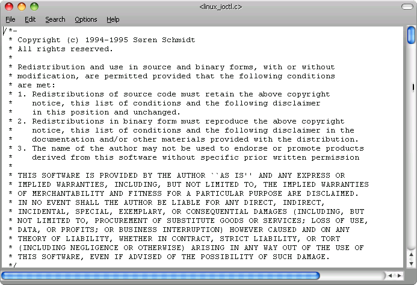
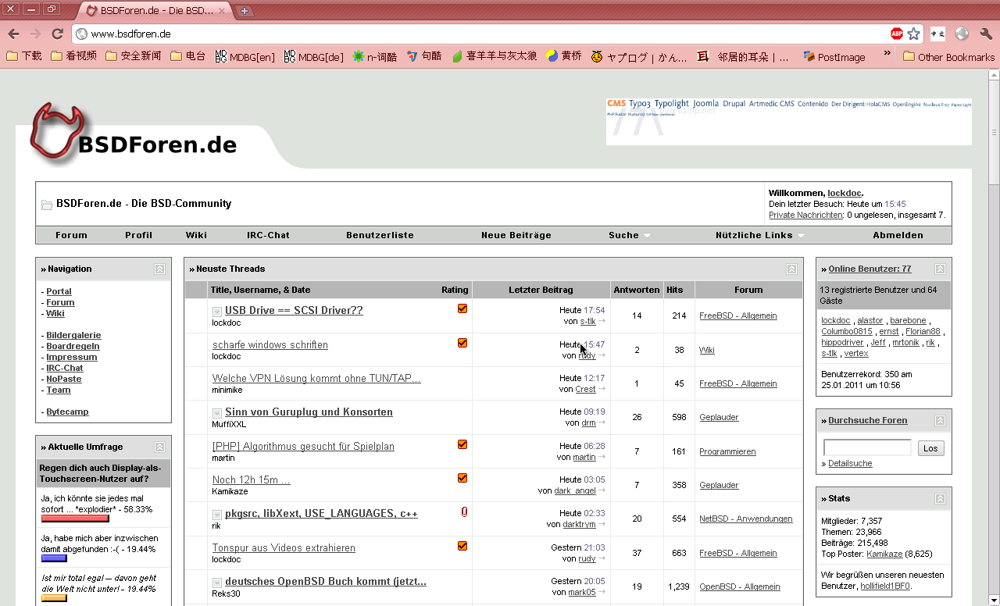

scharfe Windows Schriften
=========================

.. |date| date::

.. sidebar:: Info

  .. image:: ../images/logo-freebsd.png
  .. image:: ../images/logo-openbsd.png
  .. image:: ../images/logo-netbsd.png
  .. image:: ../images/logo-dragonflybsd.png

Ziel dieses Artikels soll es sein unter Xorg genauso scharfe klare Schriften zu
erzeugen, wie unter Windows XP. Das meisste hier gelistete Material basiert auf
diesem Artikel: http://www.howtoforge.com/sharp_fonts_gnome

Funktionalitaet
---------------

-  scharfe Standardschriften wie unter Windows XP
-  klare chinesische Schriften, auch bei einer Groesse von 8
-  schicke Terminal-Emulator Schriften

Hauptkonfiguration Konfiguration
--------------------------------

Installierte Schriftarten
~~~~~~~~~~~~~~~~~~~~~~~~~

Basic Fonts
^^^^^^^^^^^

-  `x11-fonts/dejavu <https://www.google.com/search?q=x11-fonts/dejavu&btnI=lucky>`__
-  `x11-fonts/bitstream-vera <https://www.google.com/search?q=x11-fonts/bitstream-vera&btnI=lucky>`__
-  `x11-fonts/droid-fonts-ttf <https://www.google.com/search?q=x11-fonts/droid-fonts-ttf&btnI=lucky>`__
-  `x11-fonts/urwfonts <https://www.google.com/search?q=x11-fonts/urwfonts&btnI=lucky>`__
-  `x11-fonts/webfonts <https://www.google.com/search?q=x11-fonts/webfonts&btnI=lucky>`__

Windos Fonts
^^^^^^^^^^^^

Wer moechte kann zusaetzlich noch von einem Windows Rechner seine
Windows Schriftarten rueberkopieren. Dazu sei hierhin verwiesen:
http://www.freebsd.org/doc/handbook/x-fonts.html

Terminal Emulator Fonts
^^^^^^^^^^^^^^^^^^^^^^^

Falls jemand die Terminus Schriftart nicht kennt, dass ist ein echtes
Schmuckstueck und ihr solltet mal probieren diese zu installieren und
dann im Terminal einzustellen (sehr huebsch!)

-  `x11-fonts/terminus-font <https://www.google.com/search?q=x11-fonts/terminus-font&btnI=lucky>`__

Fuer chinesische Zeichendarstellung
^^^^^^^^^^^^^^^^^^^^^^^^^^^^^^^^^^^

-  `x11-fonts/wqy <https://www.google.com/search?q=x11-fonts/wqy&btnI=lucky>`__
-  `chinese/ttfm <https://www.google.com/search?q=chinese/ttfm&btnI=lucky>`__

Fuer den letzteren Port "ttfm" muessen folgende Schriftarten zur
Verfuegung stehen: SimSun, SimHei, Tahoma.

.. code:: BASH

   root> mkdir /usr/ports/distfiles/msttf
   root> cp tahoma.ttf simhei.ttf simsun.ttf /usr/ports/distfiles/msttf
   root> cd /usr/local/chinese/ttfm/ && make install clean

Xorg.conf
~~~~~~~~~

In der Sektion "Monitor" unter der xorg.conf muss eine Aufloesung von
96dpi sein

.. code:: xorg.conf

       DisplaySize    270    203    # 1024x768  96dpi
       DisplaySize    338    211    # 1280x800  96dpi
       DisplaySize    338    254    # 1280x960  96dpi
       DisplaySize    338    270    # 1280x1024 96dpi
       DisplaySize    370    277    # 1400x1050 96dpi
       DisplaySize    423    370    # 1600x1400 96dpi
   EndSection

Das ganze laesst sich wie folgt berechnen

::

   X = (pixelsize / 96) * 25.4
   Y = (pixelsize / 96) * 25.4

Beispiel fuer 1280x800

::

   X = ( 1280 / 96 ) * 25.4 = 338.66 ~ 338
   Y = (  800 / 96 ) * 25.4 = 211.66 ~ 211

Meine Monitor Sektion sieht wie folgt aus:

.. code:: xorg.conf

   Section "Monitor"
       Identifier   "Monitor0"
       VendorName   "Monitor Vendor"
       ModelName    "Monitor Model"
       Option       "DPMS"
       DisplaySize   338 211  # 1280x800 96 dpi
       VertRefresh  60
   EndSection

~/.fonts.conf
~~~~~~~~~~~~~

Die Datei wurde fast komplett von
http://www.howtoforge.com/sharp_fonts_gnome uebernommen, mit Anpassung
fuer Chinesische Font Substitution und einer Fehlerkorrektur.

.. code:: XML

   <?xml version="1.0"?>
   <!DOCTYPE fontconfig SYSTEM "fonts.dtd">
   <fontconfig>

   <!--
        .fonts.conf
        release 6.3.23
        ================================
        LCD optimized 96 dpi
        "Sharp'N'Clear" font settings
        with emphasis on 'msttcorefonts'

        tested on Ubuntu GNU/Linux 5.10
        ================================
        by Obi Bok
        Gmail: obibok
        http://linuxtuneup.blogspot.com
        ================================
        Why was this conceived?

        - some font families look better hinted by Byte Code Interpreter (BCI)
          while other fonts look better hinted by Auto-Hinter
        - hinting type affects italic and bold fonts differently
        - antialiasing needs to be adjusted according to font families and sizes
        
        Essentially, there is no one single rule that works for all fonts.

        NOTE:
        - Verdana @ 8pt doesn't render '2' and '6' right
        - Arial shows 'Z' distorted in Firefox 1.5
   -->

   <!--
   #####################################################################################################

        Section 1

   #####################################################################################################
   -->

   <!--
        Make font sizes match the dpi set in Xorg.

        Increase or decrease this value if fonts are too small or too large
        for your screen resolution.

        FIXME: this only affects QT-based apps?
   -->
   <match target="pattern">
    <edit name="dpi" mode="assign">
     <double>96</double>
    </edit>
   </match>

   <!--
        Enable anti-aliasing.

        This only works for outline and scalable fonts.
        Bitmap and PostScript fonts do not get anti-aliased.

        FIXME: is this correct? (it was wrong! you have to set it to "false")
   -->
   <match target="font">
    <edit name="antialias" mode="assign">
     <bool>false</bool>
    </edit>
   </match>

   <!--
        Set sub-pixel order if not detected.

        "X knows the sub pixel order already, and if this is enabled as well,
        Freetype produces some very strange results. However, if you do still
        have problems, consider (...) 'rgb' (the standard for LCD monitors),
        'bgr' (unusual), 'vrgb' (vertical rgb, if you have a monitor that
        has been rotated by 90 degrees[1]), 'vgbr' (as vrgb, but very rare)."
        <http://www.linuxquestions.org/linux/answers/Hardware/\
        LCD_TFT_Monitor_Configuration_in_X_Org>

        Find out your LCD's sub-pixel order:
        <http://grc.com/image/cleartype2c.gif>
   -->
   <match target="font">
    <test qual="all" name="rgba" compare="eq">
     <const>unknown</const>
    </test>
    <edit name="rgba" mode="assign">
     <const>rgb</const>
    </edit>
   </match>

   <!--
   #####################################################################################################

        Section 2 - Anti-Aliasing Fine Tuning

   #####################################################################################################
   -->

   <!--
        Sub-pixel hinting via BCI enabled by default if compiled in.

        "Whole-pixel anti-aliasing does not represent a useful solution for
        improving small point-size type. (...) By 'borrowing' sub-pixels from
        adjacent whole pixels, we can fine-tune the placement and width of typeface
        features with three times more horizontal accuracy then ever before!"
        <http://grc.com/ctwhat.htm>
   -->

   <!--
        Disable anti-aliasing for select fonts based on size and style.

        | font                  | WinXP | Linux |
        =========================================
        Andale Mono IPA            14      13
        Arial                      12      13
        Arial Black                12      -
        Arial Narrow               14      13
        Berling Antiqua            12      13
        Book Antiqua               12      13
        Bookdings                  0       ?
        Bookman Old Style          22      13
        Century Gothic             16      16
        Comic Sans MS              11      9/11
        Courier New                26      22
        Franklin Gothic Medium     12      10/12
        Frutiger Linotype          12      10/12
        Garamond                   18      13/19
        Georgia                    12      12/13
        Impact                     16      0
        Kartika                    12      16
        Lucida Console             12      13
        Lucida Sans Typewriter     12      12
        Lucida Sans Unicode        12      10/13
        Marlett                    ?       ?
        Microsoft Sans Serif       12      12/13
        Palatino Linotype          12      13
        SylfaenARM                 -       13
        Symbol                     12      ?
        Tahoma                     12      12/13
        Times New Roman            12      13
        Trebuchet MS               12      12
        Verdana                    12      12
        Vrinda                     12      17
        Webdings                   20      ?
        Wingdings                  20      ?
        =========================================

        "The relationship of pixels to points depends on the number of pixels
        per inch, which is typically some 'standard' value corresponding to
        default screen fonts. For example, MS Windows has two standard sets of
        screen fonts initially designed for IBM display systems: 'small' (VGA)
        and 'large' (8514/A). 'Small' fonts are 96 pixels per inch, 'large' are
        120. Macintosh systems render type at a nominal 72 pixels per inch, i.e.
        one pixel = one point. Some display systems using scalable screen fonts
        allow fine tuning of pixels per inch to suit user preferences."
        <http://www.hpaa.com/css1/pxnpts.asp>

        X pt * 96 dpi / 72 dpi = Y px
   -->

   <!--
        font group #1: normal roman anti-aliased above 10pt/13.4px
   -->
   <match target="font">
    <test qual="any" name="family" compare="eq">
     <string>Franklin Gothic Medium</string>
     <string>Frutiger Linotype</string>
     <!-- Lucida Sans Unicode has no italic and uses artificial oblique -->
     <string>Lucida Sans Unicode</string>
    </test>
    <test qual="any" name="pixelsize" compare="less_eq">
     <double>13.4</double>
    </test>
    <test qual="any" name="weight" compare="less_eq">
     <const>medium</const>
    </test>
    <test qual="any" name="slant" compare="eq">
     <const>roman</const>
    </test>
    <edit name="antialias" mode="assign">
     <bool>false</bool>
    </edit>
   </match>

   <!--
        font group #2: normal roman anti-aliased above 11pt/14.7px

        Must use 15px instead of 14.7px for this to work in QT-based apps
   -->
   <match target="font">
    <test qual="any" name="family" compare="eq">
     <!-- Comic Sans MS has no italic and uses artificial oblique -->
     <string>Comic Sans MS</string>
    </test>
    <test qual="any" name="pixelsize" compare="less_eq">
     <double>15</double>
    </test>
    <test qual="any" name="weight" compare="less_eq">
     <const>medium</const>
    </test>
    <test qual="any" name="slant" compare="eq">
     <const>roman</const>
    </test>
    <edit name="antialias" mode="assign">
     <bool>false</bool>
    </edit>
   </match>

   <!--
        font group #3: normal roman anti-aliased above 12pt/16px
        
        Must use at least 16.1px instead of 16px for this to work in Firefox
   -->
   <match target="font">
    <test qual="any" name="family" compare="eq">
     <string>Georgia</string>
     <string>Lucida Sans</string>
     <string>Lucida Sans Typewriter</string>
     <!-- Microsoft Sans Serif has no italic and uses artificial oblique -->
     <string>Microsoft Sans Serif</string>
     <!-- Tahoma has no italic and uses artificial oblique -->
     <string>Tahoma</string>
     <string>Trebuchet MS</string>
     <string>Verdana</string>
    </test>
    <test qual="any" name="pixelsize" compare="less_eq">
     <double>16.1</double>
    </test>
    <test qual="any" name="weight" compare="less_eq">
     <const>medium</const>
    </test>
    <test qual="any" name="slant" compare="eq">
     <const>roman</const>
    </test>
    <edit name="antialias" mode="assign">
     <bool>false</bool>
    </edit>
   </match>

   <!--
        font group #4: normal roman anti-aliased above 13pt/17.4px
   -->
   <match target="font">
    <test qual="any" name="family" compare="eq">
     <string>Arial</string>
     <string>Arial Narrow</string>
     <string>Berling Antiqua</string>
     <string>Book Antiqua</string>
     <string>Bookman Old Style</string>
     <string>Garamond</string>
     <!-- Lucida Console has no italic and uses artificial oblique -->
     <string>Lucida Console</string>
     <string>Palatino Linotype</string>
     <string>SylfaenARM</string>
     <string>Times New Roman</string>
    </test>
    <test qual="any" name="pixelsize" compare="less_eq">
     <double>17.4</double>
    </test>
    <test qual="any" name="weight" compare="less_eq">
     <const>medium</const>
    </test>
    <test qual="any" name="slant" compare="eq">
     <const>roman</const>
    </test>
    <edit name="antialias" mode="assign">
     <bool>false</bool>
    </edit>
   </match>

   <!--
        font group #5: normal roman anti-aliased above 16pt/21.4px
   -->
   <match target="font">
    <test qual="any" name="family" compare="eq">
     <string>Century Gothic</string>
     <string>Kartika</string>
    </test>
    <test qual="any" name="pixelsize" compare="less_eq">
     <double>21.4</double>
    </test>
    <test qual="any" name="weight" compare="less_eq">
     <const>medium</const>
    </test>
    <test qual="any" name="slant" compare="eq">
     <const>roman</const>
    </test>
    <edit name="antialias" mode="assign">
     <bool>false</bool>
    </edit>
   </match>

   <!--
        font group #6: normal roman anti-aliased above 17pt/23px
   -->
   <match target="font">
    <test qual="any" name="family" compare="eq">
     <string>Vrinda</string>
    </test>
    <test qual="any" name="pixelsize" compare="less_eq">
     <double>23</double>
    </test>
    <test qual="any" name="weight" compare="less_eq">
     <const>medium</const>
    </test>
    <test qual="any" name="slant" compare="eq">
     <const>roman</const>
    </test>
    <edit name="antialias" mode="assign">
     <bool>false</bool>
    </edit>
   </match>

   <!--
        font group #7: normal roman anti-aliased above 22pt/29.4px
   -->
   <match target="font">
    <test qual="any" name="family" compare="eq">
     <string>Courier New</string>
    </test>
    <test qual="any" name="pixelsize" compare="less_eq">
     <double>29.4</double>
    </test>
    <test qual="any" name="weight" compare="less_eq">
     <const>medium</const>
    </test>
    <test qual="any" name="slant" compare="eq">
     <const>roman</const>
    </test>
    <edit name="antialias" mode="assign">
     <bool>false</bool>
    </edit>
   </match>

   <!--
        font group #8: bold roman anti-aliased above 9pt/12px
   -->
   <match target="font">
    <test qual="any" name="family" compare="eq">
     <string>Georgia</string>
    </test>
    <test qual="any" name="pixelsize" compare="less_eq">
     <double>12</double>
    </test>
    <test qual="any" name="weight" compare="more">
     <const>medium</const>
    </test>
    <test qual="any" name="slant" compare="eq">
     <const>roman</const>
    </test>
    <edit name="antialias" mode="assign">
     <bool>false</bool>
    </edit>
   </match>

   <!--
        font group #9: bold roman anti-aliased above 10pt/13.4px
   -->
   <match target="font">
    <test qual="any" name="family" compare="eq">
     <string>Tahoma</string>
     <string>Verdana</string>
    </test>
    <test qual="any" name="pixelsize" compare="less_eq">
     <double>13.4</double>
    </test>
    <test qual="any" name="weight" compare="more">
     <const>medium</const>
    </test>
    <test qual="any" name="slant" compare="eq">
     <const>roman</const>
    </test>
    <edit name="antialias" mode="assign">
     <bool>false</bool>
    </edit>
   </match>

   <!--
        font group #10: bold roman anti-aliased above 12pt/16px
   -->
   <match target="font">
    <test qual="any" name="family" compare="eq">
     <string>Courier New</string>
    </test>
    <test qual="any" name="pixelsize" compare="less_eq">
     <double>16</double>
    </test>
    <test qual="any" name="weight" compare="more">
     <const>medium</const>
    </test>
    <test qual="any" name="slant" compare="eq">
     <const>roman</const>
    </test>
    <edit name="antialias" mode="assign">
     <bool>false</bool>
    </edit>
   </match>

   <match target="font">
    <test qual="any" name="family" compare="eq">
     <string>Franklin Gothic Medium</string>
    </test>
    <test qual="any" name="size" compare="less">
     <double>9</double>
    </test>
    <edit name="antialias" mode="assign">
     <bool>false</bool>
    </edit>
   </match>

   <!--
   #####################################################################################################

        Section 3 - Hinting Fine Tuning

   #####################################################################################################
   -->

   <!--
        Enable FreeType Auto-Hinter for select fonts.

        Auto-Hinter is disabled by default if Bytecode Interpreter was compiled in.
        Some Linux "native" fonts look better hinted by Auto-Hinter,
        usually in sizes 11pt-13pt; others look better hinted by BCI.
   -->

   <!--
        Set Auto-Hinter to full hinting style.

        'slight' and 'medium' hinting often produce pixel discoloration.
   -->
   <match target="font">
    <edit name="hintstyle" mode="assign">
     <const>hintfull</const>
    </edit>
   </match>

   <!--
        font group #11: hinted via Auto-Hinter
   -->
   <match target="font">
    <test qual="any" name="family" compare="eq">
     <string>Bitstream Charter</string>
     <string>Courier 10 Pitch</string>
     <string>DejaVu Sans Condensed</string>
     <string>DejaVu Serif Condensed</string>
     <string>FreeMono</string>
     <string>FreeSans</string>
     <string>FreeSerif</string>
     <string>Luxi Mono</string>
     <string>Luxi Sans</string>
     <string>Luxi Serif</string>
     <string>MgOpen Canonica</string>
     <string>MgOpen Cosmetica</string>
     <string>MgOpen Modata</string>
     <string>MgOpen Moderna</string>
     <string>URW Bookman L</string>
     <string>URW Chancery L</string>
     <string>URW Gothic L</string>
     <string>URW Palladio L</string>
    </test>
    <edit name="autohint" mode="assign">
     <bool>true</bool>
    </edit>
   </match>

   <!--
        font group #12: normal italic hinted via Auto-Hinter at 9-10pt

        Arial hinted via BCI at 9pt has distorted 'y', at 10pt - '2'
   -->
   <match target="font">
    <test qual="any" name="family" compare="eq">
     <string>Arial</string>
    </test>
    <test qual="any" name="pixelsize" compare="more_eq">
     <double>12</double>
    </test>
    <test qual="any" name="pixelsize" compare="less_eq">
     <double>13.4</double>
    </test>
    <test qual="any" name="weight" compare="less_eq">
     <const>medium</const>
    </test>
    <test qual="any" name="slant" compare="not_eq">
     <const>roman</const>
    </test>
    <edit name="autohint" mode="assign">
     <bool>true</bool>
    </edit>
   </match>

   <!--
        font group #13: normal italic hinted via Auto-Hinter at 12pt

        This fixes distorted 'K'
   -->
   <match target="font">
    <test qual="any" name="family" compare="eq">
     <string>Book Antiqua</string>
    </test>
    <test qual="any" name="pixelsize" compare="eq">
     <double>16</double>
    </test>
    <test qual="any" name="weight" compare="less_eq">
     <const>medium</const>
    </test>
    <test qual="any" name="slant" compare="not_eq">
     <const>roman</const>
    </test>
    <edit name="autohint" mode="assign">
     <bool>true</bool>
    </edit>
   </match>

   <!--
        font group #14: normal italic hinted via Auto-Hinter at all sizes
   -->
   <match target="font">
    <test qual="any" name="family" compare="eq">
     <!-- 10, 11, 12 -->
     <string>Frutiger Linotype</string>
     <!--  8-9: 'z', '2'; 10-15, 17, 19: 'z' -->
     <string>Times New Roman</string>
     <!-- 9-10: 'N' 'Q'; 12: 'w', 'C', 'D', 'O', 'Q', 'R', '2', '9', '0' -->
     <string>Verdana</string>
    </test>
    <test qual="any" name="weight" compare="less_eq">
     <const>medium</const>
    </test>
    <test qual="any" name="slant" compare="not_eq">
     <const>roman</const>
    </test>
    <edit name="autohint" mode="assign">
     <bool>true</bool>
    </edit>
   </match>

   <!--
   #####################################################################################################

        Section 4 - Minimum Sizes

   #####################################################################################################
   -->

   <!--
        As Tahoma 8 will be the standard font, the substituted font (SimSun)
        will be unreadable in this size, so therefore set sizes always to be bigger
   -->

   <!--
        original text:
        设定中文最小字号,使得小字的中文美观
   -->
   <match target="font" >
     <test qual="any" name="family" compare="eq" >
       <string>SimSun</string>
       <string>NSimSun</string>
       <string>SimHei</string>
       <string>AR PL ShanHeiSun Uni</string>
       <string>AR PL SenKai Uni</string>
       <string>AR PL New Sung</string>
       <string>FZSongTi</string>
       <string>FZMingTiB</string>
       <string>FangSong_GB2312</string>
       <string>KaiTi_GB2312</string> 
     </test>
     <test compare="more_eq" name="pixelsize" >
       <int>8</int>
     </test>
     <test compare="less_eq" name="pixelsize" >
       <int>12</int>
     </test>
     <edit mode="assign" name="pixelsize" >
       <int>12</int>
     </edit>
   </match> 

   <!--
        Set minimum allowed size to avoid illegible fonts.
   -->
   <!-- 7pt in QT-based apps -->
   <match target="pattern">
    <test qual="any" name="size" compare="less">
     <double>7</double>
    </test>
    <edit name="size" mode="assign">
     <double>7</double>
    </edit>
   </match>

   <!-- 9.4px (7pt) in GTK-based apps -->
   <match target="pattern">
    <test qual="any" name="pixelsize" compare="less">
     <double>9.4</double>
    </test>
    <edit name="pixelsize" mode="assign">
     <double>9.4</double>
    </edit>
   </match>

   <!--
        TODO: Create rules limiting minimum sizes for these *bold* fonts:

        Andale Mono | Andale Mono IPA
        Arial
        Arial Narrow
        Berling Antiqua
        Book Antiqua
        Bookman Old Style
        Century Gothic
        Comic Sans MS
        Courier New
        Franklin Gothic Medium
        Frutiger Linotype
        Garamond
        Georgia
        Kartika
        Lucida Console
        Lucida Sans Typewriter
        Lucida Sans Unicode
        Microsoft Sans Serif
        Palatino | Palatino Linotype
        SylfaenARM
        Tahoma
        Times New Roman
        Trebuchet MS
        Verdana
        Vrinda
   -->

   <!--
        font group #15: bold fonts no smaller than 10.7px (8pt)

        FIXME: for Firefox and other GTK-based apps?
   -->
   <match target="font">
    <test qual="any" name="family" compare="eq">
     <string>Arial</string>
    </test>
    <test qual="any" name="pixelsize" compare="less">
     <double>10.7</double>
    </test>
    <test qual="any" name="weight" compare="more">
     <const>medium</const>
    </test>
    <edit name="pixelsize" mode="assign">
     <double>10.7</double>
    </edit>
   </match>

   <!--
        Anti-alias fonts with "fake" styles.

        FIXME: QT only? GTK? Firefox?
   -->
   <!-- FIXME: dirty_hack(tm) - fontconfig reports syntax errors -->
   <!-- <match target="font">
    <test qual="any" name="matrix" compare="not_eq">
     <double>0</double>
    </test>
   -->
   <!-- another approach - no errors but freezes Firefox 1.5 -->

   <match target="font">
    <test qual="any" name="matrix" compare="eq">
     <name>matrix</name>
    </test>

    <edit name="antialias" mode="assign">
     <bool>true</bool>
    </edit>
   </match>

   <!--
   #####################################################################################################

        Section 5 - Font Substitution

   #####################################################################################################
   -->

   <!--
        Substitute unavailable and/or unwanted fonts.

        Aliases will not work if the actual fonts are installed.
        Replacing font family works in Firefox (FIXME: and other GTK-based apps?)
        QT-based apps also need font foundry replaced.
        Grouping fonts for substitution doesn't work in Firefox, so we need each
        font family replaced individually.
   -->

   <!--
        sans-serif
        
        "If the font still has no generic name, add sans-serif"
        /etc/fonts.conf

        Therefore, we only substitute what we need.
   -->

   <match target="pattern">
    <test qual="any" name="family" compare="eq">
     <string>Bitstream Charter</string>
    </test>
    <edit name="family" mode="prepend" binding="same">
     <string>Arial</string>
    </edit>
   </match>

   <match target="pattern">
    <test qual="any" name="family" compare="eq">
     <string>Bitstream Vera Sans</string>
    </test>
    <edit name="family" mode="prepend" binding="same">
     <string>Arial</string>
    </edit>
   </match>

   <!-- This causes the chrome error of having squares in the sourcecode
        JS Errors still not fixed

   <match target="pattern">
    <test qual="any" name="family" compare="eq">
     <string>DejaVu Sans</string>
    </test>
    <edit name="family" mode="prepend" binding="same">
     <string>Arial</string>
    </edit>
   </match>
   -->

   <match target="pattern">
    <test qual="any" name="family" compare="eq">
     <string>DejaVu Sans Condensed</string>
    </test>
    <edit name="family" mode="prepend" binding="same">
     <string>Arial</string>
    </edit>
   </match>

   <match target="pattern">
    <test qual="any" name="family" compare="eq">
     <string>FreeSans</string>
    </test>
    <edit name="family" mode="prepend" binding="same">
     <string>Arial</string>
    </edit>
   </match>

   <match target="pattern">
    <test qual="any" name="family" compare="eq">
     <string>Helvetica</string>
    </test>
    <edit name="family" mode="prepend" binding="same">
     <string>Arial</string>
    </edit>
   </match>

   <match target="pattern">
    <test qual="any" name="family" compare="eq">
     <string>Lucida</string>
    </test>
    <edit name="family" mode="prepend" binding="same">
     <string>Arial</string>
    </edit>
   </match>

   <match target="pattern">
    <test qual="any" name="family" compare="eq">
     <!-- FIXME: may need to use "Lucida Bright" instead -->
     <string>LucidaBright</string>
    </test>
    <edit name="family" mode="prepend" binding="same">
     <string>Arial</string>
    </edit>
   </match>

   <match target="pattern">
    <test qual="any" name="family" compare="eq">
     <string>Lucida Bright</string>
    </test>
    <edit name="family" mode="prepend" binding="same">
     <string>Arial</string>
    </edit>
   </match>

   <match target="pattern">
    <test qual="any" name="family" compare="eq">
     <string>Luxi Sans</string>
    </test>
    <edit name="family" mode="prepend" binding="same">
     <string>Arial</string>
    </edit>
   </match>

   <match target="pattern">
    <test qual="any" name="family" compare="eq">
     <string>MgOpen Cosmetica</string>
    </test>
    <edit name="family" mode="prepend" binding="same">
     <string>Arial</string>
    </edit>
   </match>

   <match target="pattern">
    <test qual="any" name="family" compare="eq">
     <string>MgOpen Modata</string>
    </test>
    <edit name="family" mode="prepend" binding="same">
     <string>Arial</string>
    </edit>
   </match>

   <match target="pattern">
    <test qual="any" name="family" compare="eq">
     <string>MgOpen Moderna</string>
    </test>
    <edit name="family" mode="prepend" binding="same">
     <string>Arial</string>
    </edit>
   </match>

   <match target="pattern">
    <test qual="any" name="family" compare="eq">
     <string>System</string>
    </test>
    <edit name="family" mode="prepend" binding="same">
     <string>Arial</string>
    </edit>
   </match>

   <match target="pattern">
    <test qual="any" name="family" compare="eq">
     <string>URW Gothic L</string>
    </test>
    <edit name="family" mode="prepend" binding="same">
     <string>Arial</string>
    </edit>
   </match>

   <!--
        FIXME: Verdana renders characters '2' and '6' slightly distorted
               so it will be substituted with Arial.
   -->
   <match target="pattern">
    <test qual="any" name="family" compare="eq">
     <string>Verdana</string>
    </test>
    <edit name="family" mode="prepend" binding="same">
     <string>Arial</string>
    </edit>
   </match>

   <!--
        serif
   -->
   <match target="pattern">
    <test qual="any" name="family" compare="eq">
     <string>Bitstream Vera Serif</string>
    </test>
    <edit name="family" mode="prepend" binding="same">
     <string>Georgia</string>
    </edit>
   </match>

   <match target="pattern">
    <test qual="any" name="family" compare="eq">
     <string>DejaVu Serif</string>
    </test>
    <edit name="family" mode="prepend" binding="same">
     <string>Georgia</string>
    </edit>
   </match>

   <match target="pattern">
    <test qual="any" name="family" compare="eq">
     <string>DejaVu Serif Condensed</string>
    </test>
    <edit name="family" mode="prepend" binding="same">
     <string>Georgia</string>
    </edit>
   </match>

   <match target="pattern">
    <test qual="any" name="family" compare="eq">
     <string>FreeSerif</string>
    </test>
    <edit name="family" mode="prepend" binding="same">
     <string>Georgia</string>
    </edit>
   </match>

   <match target="pattern">
    <test qual="any" name="family" compare="eq">
     <string>Luxi Serif</string>
    </test>
    <edit name="family" mode="prepend" binding="same">
     <string>Georgia</string>
    </edit>
   </match>

   <match target="pattern">
    <test qual="any" name="family" compare="eq">
     <string>MgOpen Canonica</string>
    </test>
    <edit name="family" mode="prepend" binding="same">
     <string>Georgia</string>
    </edit>
   </match>

   <match target="pattern">
    <test qual="any" name="family" compare="eq">
     <string>New Century Schoolbook</string>
    </test>
    <edit name="family" mode="prepend" binding="same">
     <string>Georgia</string>
    </edit>
   </match>

   <match target="pattern">
    <test qual="any" name="family" compare="eq">
     <string>New York</string>
    </test>
    <edit name="family" mode="prepend" binding="same">
     <string>Georgia</string>
    </edit>
   </match>

   <match target="pattern">
    <test qual="any" name="family" compare="eq">
     <string>Palatino</string>
    </test>
    <edit name="family" mode="prepend" binding="same">
     <string>Georgia</string>
    </edit>
   </match>

   <match target="pattern">
    <test qual="any" name="family" compare="eq">
     <string>Times</string>
    </test>
    <edit name="family" mode="prepend" binding="same">
     <string>Georgia</string>
    </edit>
   </match>

   <match target="pattern">
    <test qual="any" name="family" compare="eq">
     <string>URW Bookman L</string>
    </test>
    <edit name="family" mode="prepend" binding="same">
     <string>Georgia</string>
    </edit>
   </match>

   <match target="pattern">
    <test qual="any" name="family" compare="eq">
     <string>URW Palladio L</string>
    </test>
    <edit name="family" mode="prepend" binding="same">
     <string>Georgia</string>
    </edit>
   </match>

   <!--
        monospace
   -->
   <match target="pattern">
    <test qual="any" name="family" compare="eq">
     <string>Andale Mono</string>
    </test>
    <edit name="family" mode="prepend" binding="same">
     <string>Courier New</string>
    </edit>
   </match>

   <match target="pattern">
    <test qual="any" name="family" compare="eq">
     <string>Bitstream Vera Sans Mono</string>
    </test>
    <edit name="family" mode="prepend" binding="same">
     <string>Courier New</string>
    </edit>
   </match>

   <match target="pattern">
    <test qual="any" name="family" compare="eq">
     <string>Courier</string>
    </test>
    <edit name="family" mode="prepend" binding="same">
     <string>Courier New</string>
    </edit>
   </match>

   <match target="pattern">
    <test qual="any" name="family" compare="eq">
     <string>DejaVu Sans Mono</string>
    </test>
    <edit name="family" mode="prepend" binding="same">
     <string>Courier New</string>
    </edit>
   </match>

   <match target="pattern">
    <test qual="any" name="family" compare="eq">
     <string>Fixedsys</string>
    </test>
    <edit name="family" mode="prepend" binding="same">
     <string>Courier New</string>
    </edit>
   </match>

   <match target="pattern">
    <test qual="any" name="family" compare="eq">
     <string>FreeMono</string>
    </test>
    <edit name="family" mode="prepend" binding="same">
     <string>Courier New</string>
    </edit>
   </match>

   <match target="pattern">
    <test qual="any" name="family" compare="eq">
     <!-- FIXME: Ubuntu Wiki uses "Lucida Typewriter" instead -->
     <string>LucidaTypewriter</string>
    </test>
    <edit name="family" mode="prepend" binding="same">
     <string>Courier New</string>
    </edit>
   </match>

   <match target="pattern">
    <test qual="any" name="family" compare="eq">
     <string>Lucida Typewriter</string>
    </test>
    <edit name="family" mode="prepend" binding="same">
     <string>Courier New</string>
    </edit>
   </match>

   <match target="pattern">
    <test qual="any" name="family" compare="eq">
     <string>Luxi Mono</string>
    </test>
    <edit name="family" mode="prepend" binding="same">
     <string>Courier New</string>
    </edit>
   </match>

   <match target="pattern">
    <test qual="any" name="family" compare="eq">
     <string>Monaco</string>
    </test>
    <edit name="family" mode="prepend" binding="same">
     <string>Courier New</string>
    </edit>
   </match>

   <match target="pattern">
    <test qual="any" name="family" compare="eq">
     <string>Terminal</string>
    </test>
    <edit name="family" mode="prepend" binding="same">
     <string>Courier New</string>
    </edit>
   </match>

   <!--
        cursive
   -->
   <match target="pattern">
    <test qual="any" name="family" compare="eq">
     <string>Apple Chancery</string>
    </test>
    <edit name="family" mode="prepend" binding="same">
     <string>Comic Sans MS</string>
    </edit>
   </match>

   <match target="pattern">
    <test qual="any" name="family" compare="eq">
     <string>Lucida Handwriting</string>
    </test>
    <edit name="family" mode="prepend" binding="same">
     <string>Comic Sans MS</string>
    </edit>
   </match>

   <match target="pattern">
    <test qual="any" name="family" compare="eq">
     <string>URW Chancery L</string>
    </test>
    <edit name="family" mode="prepend" binding="same">
     <string>Comic Sans MS</string>
    </edit>
   </match>

   <match target="pattern">
    <test qual="any" name="family" compare="eq">
     <string>Zapf Chancery</string>
    </test>
    <edit name="family" mode="prepend" binding="same">
     <string>Comic Sans MS</string>
    </edit>
   </match>

   <!--
        fantasy
   -->
   <match target="pattern">
    <test qual="any" name="family" compare="eq">
     <string>Copperplate</string>
    </test>
    <edit name="family" mode="prepend" binding="same">
     <string>Impact</string>
    </edit>
   </match>

   <match target="pattern">
    <test qual="any" name="family" compare="eq">
     <string>Desdemona</string>
    </test>
    <edit name="family" mode="prepend" binding="same">
     <string>Impact</string>
    </edit>
   </match>

   <match target="pattern">
    <test qual="any" name="family" compare="eq">
     <string>Kino</string>
    </test>
    <edit name="family" mode="prepend" binding="same">
     <string>Impact</string>
    </edit>
   </match>

   <match target="pattern">
    <test qual="any" name="family" compare="eq">
     <string>Techno</string>
    </test>
    <edit name="family" mode="prepend" binding="same">
     <string>Impact</string>
    </edit>
   </match>

   <!--
   #####################################################################################################

        Section 6 - Aliases for Font Names

   #####################################################################################################
   -->

   <!--
        Provide required aliases for standard names.
   -->
   <alias>
    <family>sans-serif</family>
     <prefer>
      <family>Arial</family>
     </prefer>
   </alias>

   <alias>
    <family>serif</family>
     <prefer>
      <family>Georgia</family>
     </prefer>
   </alias>

   <alias>
    <family>monospace</family>
     <prefer>
      <family>Courier New</family>
     </prefer>
   </alias>

   <alias>
    <family>cursive</family>
     <prefer>
      <family>Comic Sans MS</family>
     </prefer>
   </alias>

   <alias>
    <family>fantasy</family>
     <prefer>
      <family>Impact</family>
     </prefer>
   </alias>

   </fontconfig>

Window Manager spezifisches
---------------------------

============== ======== =======================================
Window Manager getested zusaetzliche Einstellungen erforderlich
============== ======== =======================================
Gnome          Ja       Ja
KDE            Nein     -
XFCE           Nein     -
Fluxbox        Nein     -
============== ======== =======================================

Gnome
~~~~~

Im Menu

::

   System -> Preferences -> Appearance

Dan zu Fonts wechseln

::

   **Fonts**
   Application Font
   Document Font
   Desktop Font
   Windows Title Font
   Fixed width Font

   **Rendering**
   [ ] Monochrome        [ ] Best Shaped
   [ ] Best Contrast     [X] Subpixel Smoothing (LCD)

Danach zu **Details** wechseln

::

   **Font Rendering Details**

   Resolution: [96] dots per inch

   **Smoothing**
   [ ] None              [ ] Grayscale
   [X] Subpixel (LCD)

   **Hinting**
   [ ] None              [ ] Slight
   [ ] Medium            [X] Full

   **Subpixel Order**
   (*) RGB               ( ) BGR
   ( ) VRGB              ( ) VBGR

Probleme
--------

<note>Derzeit gibt es ein paar Probleme mit Webseiten</note>

FIXME

================ ============================================== ========================== ============================================================== ==========
Browser          Page                                           Beschreibung               Ursache                                                        Datum
================ ============================================== ========================== ============================================================== ==========
Chrome / Firefox www.golem.de                                   Schriften sehr unleserlich font: normal normal 400 14px/20px 'Droid Serif',georgia,serif; 02.06.2011
Chromr / Firefox http://www.hsk.org.cn/news/news20101108_c.html Schriften sehr unleserlich font-family: "宋体", "Arial Unicode MS";                       2.06.2011
================ ============================================== ========================== ============================================================== ==========

Screenshots
-----------

... Todo

Notepad
~~~~~~~

**FreeBSD Gnome** |Screenshot1|

**Windows** FIXME

Chrome
~~~~~~

**FreeBSD Gnome** |Screenshot2|

**Windows** FIXME

Firefox
~~~~~~~

**FreeBSD Gnome** |Screenshot3|

**Windows** FIXME

Desktop
~~~~~~~

**FreeBSD Gnome** |Screenshot4|

**Windows** FIXME

Terminal mit Terminus
~~~~~~~~~~~~~~~~~~~~~

|Screenshot5|

Todo
----

-  Screenshots von Windows und Xorg mit (ein paar Standardapplikationen,
   Firefox, Chrome, etc) um den Vergleich zu sehen und auch evtl.
   Unterschiede
-  Problem-Section
-  Testen auf KDE, XFCE, Fluxbox, evtl weitere

Dokumentation der Aenderungen
-----------------------------

Damit man auf einen Blick schnell sieht, ob irgendetwas an den
Konfigurationsdateien geaendert wurde, gibt es diese Sektion hier

Links
-----

-  `Gnome Howto Sharp
   Fonts <http://www.howtoforge.com/sharp_fonts_gnome>`__
-  http://hi.baidu.com/linuxcfan/blog/item/f561b48c613f461bb31bbad2.html
-  http://www.freebsd.org/doc/handbook/x-fonts.html

.. |Screenshot3| image:: images/bsd_firefox.png
   :width: 180px
.. |Screenshot4| image:: images/bsd_desktop.png
   :width: 180px
.. |Screenshot5| image:: images/bsd_terminal.png
   :width: 180px

* :ref:`genindex`

Zuletzt geändert: |date|

