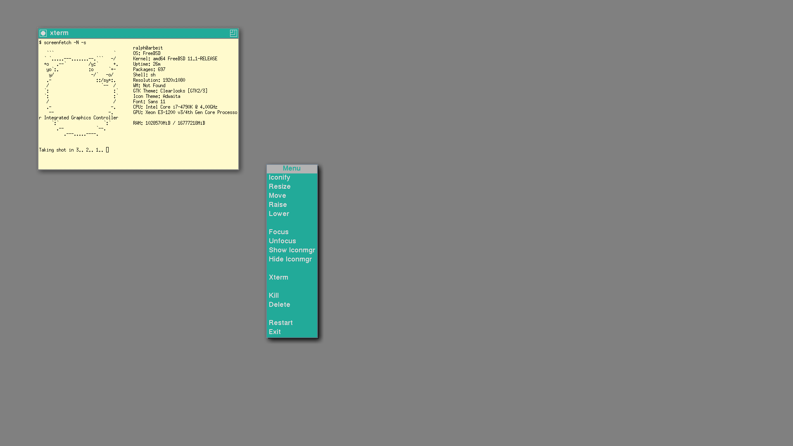
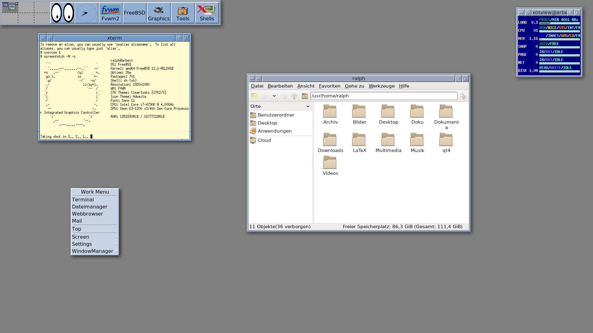
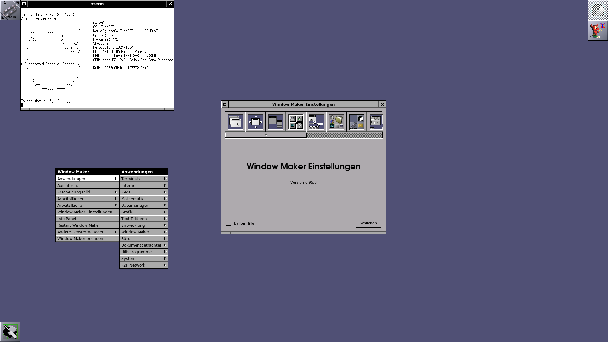
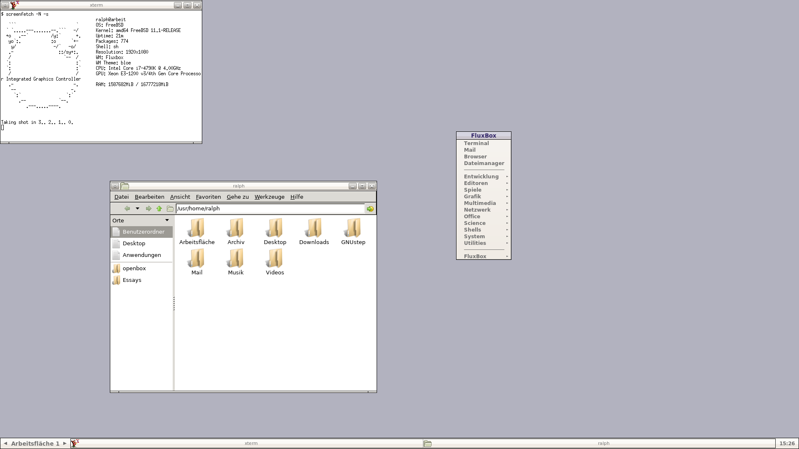
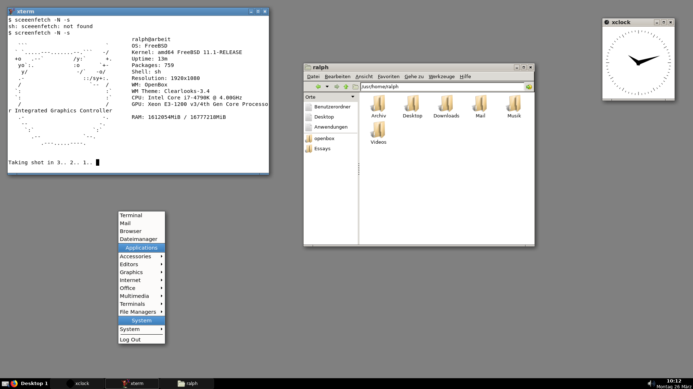

Windowmanager
=============

.. |date| date::

.. sidebar:: Info

  .. image:: ../images/logo-freebsd.png

Dieses HowTo behandelt die Installation und die Konfiguration diverser
Windowmanager.

Was ist ein Windowmanager
-------------------------

Windowmanager haben die Aufgabe, den Anwendungsprogrammen das
Verschieben, Minimieren, Vergrößern und Schließen von Fenstern zu
ermöglichen. Neben diesen Funktionen zeichnet ein Windowmanager noch die
Dekoration um die Fenster, wie etwa die Leiste mit dem Titel oder eine
äußere Umrandung.

Einige Windowmanager bieten noch die Unterstützung für D-Bus, Docks,
Panel, Programmstarter, Icons auf dem Desktop, optische Designs und
Hintergrundbilder. Voll ausgebaut haben sie eine ähnliche Funktionalität
wie komplette Desktop-Umgebungen. Die meisten Fenstermanager können mit
der Maus bedient oder mit der Tastatur angesteuert werden.

Auch Desktop-Umgebungen benötigen Windowmanager, bei KDE etwa Kwin, bei
Gnome 3 ist es Mutter.

Die einfachen Windowmanager unterscheiden sich jeweils durch ihre
unterschiedliche Erweiterbarkeit, der Art und Weise der Bedienung sowie
durch ihre Art und ihr Design, Fenster darzustellen.

Warum Windowmanager
-------------------

Wann ist der Einsatz von Windowmanagern sinnvoll?

Wem komplette Desktop Umgebungen wie KDE oder Gnome mit ihren
zahlreichen standardmäßig mitinstallierten Diensten zu umfangreich sind
und er es eher puritanisch und übersichtlich liebt, für diese
Individualisten gibt es als resourcensparende Alternative die
sogenannten Windowmanager. Sie sind schnell installiert, brauchen nur
wenig Arbeitsspeicher und sind auch auf älteren Rechnern durchaus
performant.

Auswahl Windowmanager
---------------------

twm
---

Beschreibung
~~~~~~~~~~~~

twm (für Tom's Window Manager oder Tab Window Manager) ist ein
Windowmanager für das X Window System. Vorteile sind seine geringe Größe
(circa 140 KB) und seine Stabilität. Im Vergleich zu den meisten anderen
Windowmanagern ist sein Funktionsumfang minimalistisch, weil twm sich
ausschließlich auf die Verwaltung von Fenstern beschränkt und nicht
versucht, eine Schnittstelle für Funktionen des Betriebssystems
darzustellen.

Auch wenn er heute meist nur noch genutzt wird, wenn kein anderer Window
Manager zur Verfügung steht, gibt es immer noch eine kleine Gruppe an
Benutzern, die twm dank seiner Einfachheit, Erweiterbarkeit und
Leichtgewichtigkeit schätzen – nicht zuletzt auch deshalb, weil er
direkt in der Programmiersprache C geschrieben ist und nur die
Kernfunktionen der Xlib benutzt, statt ein umfangreiches GUI-Toolkit wie
GTK+ oder Qt zu nutzen.

Bei der X.Org-Referenzimplementierung des X Window Systems ist der twm
noch immer der standardmäßige Windowmanager und auch bei vielen anderen
Implementierungen dabei. twm ist freie Software und steht unter der
MIT-Lizenz (auch „X11-Lizenz“ genannt, um Verwechslungen mit anderen
Lizenzen des MIT zu verhindern).

Quelle: `Wikipedia <https://de.wikipedia.org/wiki/Twm>`__

Geschichte
~~~~~~~~~~

1987 schrieb Tom LaStrange die erste twm-Version aus Frustration über
den damaligen Standard-WIndowmanager uwm. twm ist damit einer der
ältesten Windowmanager. Seit X11R4 (1989) ist er der
Standard-Windowmanager für das X-Window-System und läuft dadurch auf
jedem System, auf dem X11 installiert ist.

Quelle: `Wikipedia <https://de.wikipedia.org/wiki/Twm>`__

Beschaffung und Installation
~~~~~~~~~~~~~~~~~~~~~~~~~~~~

Aus den Ports :

::

   # cd /usr/ports/x11-wm/twm

Als fertiges Binärpaket : ist durch die Grundinstallation von FreeBSD
mit dem Paket xorg bereits vorhanden.

Konfiguration
~~~~~~~~~~~~~

Die globale Konfigurationsdatei system.twmrc befindet sich im Ordner
/usr/local/share/X11/twm/system.twmrc.

Wir kopieren die system.twmrc in unser Home Verzeichnis und benennen sie
um in .twmrc.

Nun können wir die .twmrc mit einem Editor unserer Wahl editieren und
unseren Wünschen gemäß anpassen.

Start
~~~~~

Wenn wir ohne Loginmanager arbeiten und X mit startx von der Konsole
starten, müssen wir im Homeverzeichnis eine .xinitrc erstellen und
tragen dort folgendes ein:

::

   exec twm

Wenn ein Desktopsystem wie KDE installiert wird und der Loginmanager kdm
benutzt wird, wird automatisch eine twm.desktop Datei erstellt in

/usr/local/share/apps/kdm/sessions. Twm taucht dann automatisch im
Auswahlmenu des KDM Loginmanagers von KDE auf.

.. note::

  Dieser Windowmanager spielt in der Praxis kaum noch eine Rolle, wird aber aus
  historischen Gründen mitaufgeführt. 

Screenshot
~~~~~~~~~~

|image1|

mwm
---

.. _beschreibung-4:

Beschreibung
~~~~~~~~~~~~

Der Motif Window Manager (mwm) ist ein in die Jahre gekommener
Dinosaurier und Urahn aller Fenster-Manager unter UNIX-Systemen.
Ursprünglich kommerziell, ist er mittlerweile freigegeben in dem Paket
openmotif vorhanden. Er zeichnet sich dadurch aus, dass er keinerlei
Hintergrundprozesse startet. Der mwm ist somit auch für langsame Rechner
bestens geeignet. Er stellt eine Iconbox bereit, der Bildschirm sieht
somit immer aufgeräumt aus.

.. _geschichte-4:

Geschichte
~~~~~~~~~~

Motif ist nicht nur ein Window-Manager sondern in erster Linie ein
Toolkit zur Erstellung graphischer Benutzeroberflächen mit X11. Dieses
Toolkit wurde bereits in den frühen 90er Jahren zum De-Facto-Standard
für kommerzielle X-Applikationen und somit auch der
Motif-Window-Manager, kurz mwm, auf den meisten UNIX-Varianten. Der
Original-Source-Code, eingefroren auf Version 2.1.30, steht nach wie vor
unter der Ägide der Open Group und ist gebührenpflichtig. Der Source
Code dieser Version wurde von der Open Group unter der Bezeichnung Open
Motif eingeschränkt freigegeben.

.. _beschaffung-und-installation-4:

Beschaffung und Installation
~~~~~~~~~~~~~~~~~~~~~~~~~~~~

Aus den Ports:

::

   # cd /usr/ports/x11-toolkits/open-motif

   # make install clean

Als fertiges Binärpaket:

::

   # pkg install open-motif

.. _konfiguration-4:

Konfiguration
~~~~~~~~~~~~~

Die globale Konfigurationsdatei **system.mwmrc** befindet sich im Ordner
**/usr/local/lib/X11/system.mwmrc**.

Wir kopieren die **system.mwmrc** in unser Home Verzeichnis und benennen
sie um in **.mwmrc**.

Nun können wir die **.mwmrc** mit einem Editor unserer Wahl editieren
und unseren Wünschen gemäß anpassen.

.. _start-4:

Start
~~~~~

Wenn wir ohne Loginmanager arbeiten und X mit startx von der Konsole
starten, müssen wir im Homeverzeichnis eine .xinitrc erstellen und
tragen dort folgendes ein:

::

   exec mwm

Eine komplette typische .xinitrc sieht wie folgt aus:

::

   export LANG=de_DE.UTF-8

   setxkbmap de

   exec mwm

.. _screenshot-4:

Screenshot
~~~~~~~~~~

|image2|

fvwm
----

.. _beschreibung-2:

Beschreibung
~~~~~~~~~~~~

FVWM (F Virtual Window Manager) ist ein freier, ICCCM-konformer und
modularer Fenstermanager für das X Window System.

Hauptmerkmale von FVWM sind die umfangreiche und vielfältige
Konfigurierbarkeit des Fensterverwalters über Konfigurationsdateien und
die Verwendung von virtuellen Arbeitsplätzen. Viele aktuelle
Fensterverwalter sind mit FVWM verwandt, unter anderem AfterStep, Xfce
oder Enlightenment.

`Quelle: Wikipedia <https://de.wikipedia.org/wiki/FVWM>`__

.. _geschichte-2:

Geschichte
~~~~~~~~~~

Robert Nation beschloss im Juli des Jahres 1993, sich genauer mit dem
damals allgegenwärtigen Twm zu beschäftigen, da ihn TWM bei der Analyse
akustischer Signaturen für das Verteidigungsministerium der Vereinigten
Staaten zu sehr einschränkte.

Unter anderem fand er heraus, warum der TWM soviel Speicher in Anspruch
nahm und wie man sog. virtuelle Arbeitsoberflächen realisiert und
implementiert.

Damals schon bekannt für seinen Terminalemulator rxvt, arbeitete Rob
Nation an der Verminderung des Speicherverbrauchs seines neuen
Fensterverwalters. Neugierig auf die Reaktion der Gemeinde verband er
den FVWM mit einem neuen rxvt-Release. Da viele Benutzer die
Umständlichkeiten und die Einschränkungen des TWM leid waren, kam ihnen
eine vernünftige Alternative gerade recht.

1994 verließ Nation das Projekt; er ernannte Charles Hines zum
Verantwortlichen. Nations letztes Release war fvwm-1.24r. Aufgrund der
völligen Neugestaltung der Architektur nach Nations Weggang und den
daraus resultierenden Inkompatibilitäten zwischen den
Konfigurationsdateien der alten und neuen Generationen bieten viele
Linux-Distributionen beide Generationen des FVWM parallel an. Da (im
Jahr 2005) fvwm-1.24r auf modernen Linuxsystemen immer noch ohne
Probleme kompiliert und ausgeführt werden kann, gibt es immer noch eine
kleine Anzahl von Benutzern, die dieses ältere FVWM-Release verwenden.

`Quelle: Wikipedia <https://de.wikipedia.org/wiki/FVWM>`__

.. _beschaffung-und-installation-2:

Beschaffung und Installation
~~~~~~~~~~~~~~~~~~~~~~~~~~~~

Aus den Ports:

::

   # cd /usr/ports/x11-wm/fvwm

   # make install clean

Als fertiges Binärpaket:

::

   # pkg install fvwm

.. _konfiguration-2:

Konfiguration
~~~~~~~~~~~~~

Die globale Konfigurationsdatei **system.fvwm2rc** befindet sich im
Ordner **/usr/local/etc/system.fvwm2rc** Wir kopieren die
**system.fvwm2rc** in unser Home Verzeichnis und benennen sie um in
**.fvwm2rc**.

Nun können wir die **.fvwm2rc** mit einem Editor unserer Wahl editieren
und unseren Wünschen gemäß anpassen.

Wir machen eine Sicherheitskopie, falls wir bei unseren Änderungen
Fehler machen sollten.

.. note::

  Hier werden nur einige grundsätzliche Anpassungen besprochen. Für
  weitergehende Konfigurationsmöglichkeiten sind daher stets die Manpage zu
  konsultieren. Der Fenstermanager fvwm ist hochkonfigurierbar und unbegrenzt
  erweiterbar.

Als erstes laden wir die Konfigurationsdatei **.fvwm2rc** in einen
Editor unserer Wahl.

**Änderung und Anpassung der Fonts**

Die Änderung des globalen Fonts für das Menü habe ich auf die
Schriftgröße 12 geändert.

Wir gehen dazu zu dem Abschnitt #fonts - DefaultFont und editieren diese
Zeile:

::

   "StringEncoding=UTF-8:xft:sans-serif:encoding=iso10646-4:size=10;-misc-*-medium-r-semicondensed-*-13-*-*-*-*-*-iso10646-1"

Hier habe ich die Schriftgröße auf size=12 gesetzt.

**Änderung und Anpassung der Schriftgröße für die IconFonts**

::

   "StringEncoding=UTF-8:xft:sans-serif:encoding=iso10646-4:size=8;-misc-fixed-medium-r-normal-*-10-*-*-*-*-*-iso10646-1"

Hier habe ich die Schriftgröße auf size=10 gesetzt.

**Änderung und Anpassung des Menus**

Wir suchen den Bereich WorkMenu

::

   AddToMenu WORK_MENU_popup "Work Menu"   Title

   + "xterm"        Exec exec xterm

   + "Firefox"      Exec exec firefox

   + "Mail"         Exec exec claws-mail

   + "Dateimanager" Exec exec pcmanfm

und passen diese Zeilen unseren Bedürfnissen an.

**Änderung und Anpassung der Styles und des Click Verhaltens**

von

::

   Style    *    SloppyFocus

auf

::

   Style    *    ClickToFocus

Hier wrd die Fensterpositionierung konfiguriert:

::

   # Style    *    SmartPlacement, RandomPlacement, ActivePlacement
   Style    *    SmartPlacement, RandomPlacement
   Style    *    NoPPosition

**Wallpaper ändern oder deaktivieren**

Hier werden auch Autostart Funktionen konfiguriert

Es wird automatisch xterm gestartet

Es wird kein Hintergrundbild geladen

Dafür wird der Hintergrund mit SteelBlue gezeichnet

::

   xsetroot -solid SteelBlue

::

   AddToFunc StartFunction
   + I Test (Init) Module FvwmBanner
   + I Exec exec xsetroot -solid SteelBlue
   + I Test (Init) Exec exec xterm -ls -geometry +150+85
   # + I Test (Init) Exec exec xli -onroot -fillscreen -border black #/usr/share/wallpapers/default-1600x1200.jpg
   + I Module FvwmButtons

**Pfad für pixmaps**

**/usr/local/share/fvwm/pixmaps**

sollte auch in der **.fvwm2rc** eingetragen sein oder werden:

::

   ImagePath /usr/local/share/fvwm/pixmaps

Eine wichtige Anlaufstelle ist auch www.fvwm.org

Dort ist alles dokumentiert und es gibt auch viele Screenshots, zum Teil
auch mit herunterladbarer Konfigurationsdatei.

Start
~~~~~

Wenn wir ohne Loginmanager arbeiten und X mit startx von der Konsole
starten, müssen wir im Homeverzeichnis eine .xinitrc erstellen und
tragen dort folgendes ein::

  exec fvwm.

Eine komplette typische .xinitrc sieht wie folgt aus:

::

   export LANG=de_DE.UTF-8

   setxkbmap de

   exec fvwm

.. _screenshot-2:

Screenshot
~~~~~~~~~~

|image3|

Windowmaker
-----------

.. _beschreibung-3:

Beschreibung
~~~~~~~~~~~~

Der Window Maker (kurz wmaker) ist ein von Alfredo Kojima geschriebener
Fenstermanager für das X Window System.

Vom Design ist er an OPENSTEP angelehnt und als Verbesserung von
AfterStep gedacht. Er bietet ein funktionales Äußeres mit umfangreichen
Konfigurationsmöglichkeiten bei geringer RAM- und CPU-Belastung.

Window Maker ist der bevorzugte Fenstermanager für GNUstep, obwohl
Window Maker selbst WINGs („WINGs is not GNUstep“) verwendet.

Auch KDE- und Gnome-Anwendungen können unter Window Maker ausgeführt
werden.

`Quelle Wikipedia <https://de.wikipedia.org/wiki/Window_Maker>`__

Window Maker kommt mit einem eigenen grafischen Kontrollzentrum daher
und läßt sich daher schnell und einfach an die persönlichen Bedürfnissen
anpassen.

.. _geschichte-3:

Geschichte
~~~~~~~~~~

Die Mac-OS-X-Bedienphilosophie erfreut sich auch auch heute noch einiger
Beliebtheit. Window Maker ist als Nachbau der Oberfläche von „NeXTStep“
konzipiert, ein System, das Apple kaufte und als Grundlage für die
Entwicklung des späteren Mac OS X nahm. Window Maker hat sich in den
nunmehr über 20 Jahren seines Bestehens nicht wesentlich verändert, wird
aber nach einer Pause von ein paar Jahren wider aktiv weiter entwickelt.

Die Oberfläche strahlt etwas sehr archaisches, individuelles aus, ist
aber technisch sehr wohl auf der Höhe der Zeit.

.. _beschaffung-und-installation-3:

Beschaffung und Installation
~~~~~~~~~~~~~~~~~~~~~~~~~~~~

Aus den Ports:

::

   # cd /usr/ports/x11-wm/windowmaker

   # make install clean

Als fertiges Binärpaket:

::

   # pkg install windowmaker

.. _konfiguration-3:

Konfiguration
~~~~~~~~~~~~~

.. _start-3:

Start
~~~~~

Wenn wir ohne Loginmanager arbeiten und X mit startx von der Konsole
starten, müssen wir im Homeverzeichnis eine .xinitrc erstellen und
tragen dort folgendes ein:

::

   exec wmaker

Eine komplette typische .xinitrc sieht wie folgt aus:

::

   export LANG=de_DE.UTF-8

   setxkbmap de

   exec wmaker

.. _screenshot-3:

Screenshot
~~~~~~~~~~

|image4|

Fluxbox
-------

.. _beschreibung-5:

Beschreibung
~~~~~~~~~~~~

Fluxbox ist ein Fenstermanager für das X Window System in unixoiden
Betriebssystemen. Der Fokus der Entwickler liegt auf einem möglichst
sparsamen Umgang mit Betriebsmitteln und einer tiefgehenden
Konfigurationsmöglichkeit.

Trotz seiner Schlichtheit kann Fluxbox stark auf die persönlichen
Bedürfnisse angepasst werden. Die Fenster von Programmen mit grafischer
Oberfläche können in ihrem Verhalten, Aussehen und ihrer Größe
detailreich konfiguriert und gar zu einer Einheit zusammengefasst werden
(ähnlich wie beim Tabbed Browsing), unabhängig davon, ob das jeweilige
Programm dies unterstützt oder nicht. Weitere Möglichkeiten zur
Anpassung, wie das Festlegen von Tastenkombinationen, das Bearbeiten der
Menüs oder das Entwerfen neuer Desktop-Designs sind ebenfalls vorhanden.
Sämtliche Einstellungen werden über Konfigurationsdateien vorgenommen,
die Plain text enthalten und mit gewöhnlichen Texteditoren bearbeitet
werden können.

Die Entwickler fokussieren sich sowohl auf eine übersichtlich gestaltete
Oberfläche als auch auf eine möglichst ressourcenschonende Arbeitsweise.
So zeichnet sich Fluxbox durch eine geringe Auslastung von
Arbeitsspeicher und Hauptprozessor, sowie einen geringeren Bedarf an
Speicherplatz auf der Festplatte aus. Erzielt wird dies durch den
bewussten Verzicht auf aufwändig gestaltete Grafiken, Animationen oder
andere Eigenschaften, welche die Systemauslastung steigern würden. Die
Verwendung von Fluxbox kann deshalb besonders für den Einsatz auf
leistungsschwachen Systemen wie älteren Computern oder Live-Systemen
vorteilhaft sein. Die Distribution Damn Small Linux verwendet Fluxbox
standardmäßig. Auch von Ubuntu gab es mit Fluxbuntu und Linux Mint
Fluxbox speziell für Fluxbox gestaltete Derivate.

`Quelle Wikipedia <https://de.wikipedia.org/wiki/Fluxbox>`__

.. _geschichte-5:

Geschichte
~~~~~~~~~~

Fluxbox ging als Abspaltung aus Blackbox hervor und ist mit diesem von
Konfiguration und Handhabung her zu einem großen Teil identisch.

.. _beschaffung-und-installation-5:

Beschaffung und Installation
~~~~~~~~~~~~~~~~~~~~~~~~~~~~

Aus den Ports:

::

   # cd /usr/ports/x11-wm/fluxbox

   # make install clean

Als fertiges Binärpaket:

::

   # pkg install fluxbox

.. _konfiguration-5:

Konfiguration
~~~~~~~~~~~~~

Um bereits installierte Anwendungen ins fluxbox Menu automatisch
einzubinden, installieren wird das Paket menumaker.

::

   # pkg install menumaker

Wir starten das Python Script in der Konsole mit

::

   # mmaker -f fluxbox

Es wird automatisch eine Menudatei menu generiert im Ordner .fluxbox
unseres Homeverzeichnisses, das mit bereits installierten Anwendungen
befüllt wird. Sie kann jederzeit mit einem Texteditor unserer Wahl an
unsere eigenen Bedürfnisse angepaßt werden.

**Beispiel:**

Wir laden die **.fluxbox/menu** in einen Editor unserer Wahl und fügen
an den Anfang nach

::

   [begin] (FluxBox)

folgende Zeilen ein:

::

   [exec] (Terminal) {xterm}

   [exec] (Mail) {claws-mail}

   [exec] (Browser) {firefox}

   [exec] (Dateimanager) {pcmanfm}

   [separator]

.. _start-5:

Start
~~~~~

Wenn wir ohne Loginmanager arbeiten und X mit startx von der Konsole
starten, müssen wir im Homeverzeichnis eine .xinitrc erstellen und
tragen dort folgendes ein:

::

   exec startfluxbox

Eine komplette typische .xinitrc sieht wie folgt aus:

::

   export LANG=de_DE.UTF-8

   setxkbmap de

   exec startfluxbox

.. _screenshot-5:

Screenshot
~~~~~~~~~~

|image5|

IceWM
-----

.. _beschreibung-6:

Beschreibung
~~~~~~~~~~~~

IceWM ist ein in C++ programmierter, unter LGPL stehender Fenstermanager
für das X11-Fenstersystem. Er ist ein resourcensparender, performanter
Windowmanager, der durch seine Einfachheit und unkomplizierte
Konfiguration besticht. Er glänzt auch durch seine Themenvielfalt.

.. _geschichte-6:

Geschichte
~~~~~~~~~~

IceWM wurde bereits 1997 von Marko Macek präsentiert, der seinen
Fenstermanager nach wie vor weiterentwickelt. Sein Ziel lag dabei auf
eine hohe Geschwindigkeit, Einfachheit und Benutzerfreundlichkeit. Als
minimale Hardwarevoraussetzung nennt die Homepage einen 386-Prozessor,
wie er Ende der 80er Jahre aktuell war. IceWM läuft folglich auf jedem
Rechner, auf dem eine grafische Oberfläche in Form des X Window Systems
startet.

Bereits seit Ende der neunziger Jahre des letzten Jahrtausends in
Entwicklung, erlangte IceWM durch die Vorinstallation auf den ersten
Asus Eee PCs ab 2007 größere Verbreitung.

.. _beschaffung-und-installation-6:

Beschaffung und Installation
~~~~~~~~~~~~~~~~~~~~~~~~~~~~

Aus den Ports:

::

   # cd /usr/ports/x11-wm/icewm

   # make install clean

Als fertiges Binärpaket:

::

   # pkg install icewm

.. _konfiguration-6:

Konfiguration
~~~~~~~~~~~~~

Um bereits installierte Anwendungen ins Icewm Menu automatisch
einzubinden, installieren wird das Paket **menumaker**.

::

   # pkg install menumaker

Wir starten das Python Script in der Konsole mit

::

   # mmaker -f icewm

Es wird automatisch eine Menudatei **menu** generiert im Ordner
**.icewm** unseres Homeverzeichnisses, das mit bereits installierten
Anwendungen befüllt wird. Sie kann jederzeit mit einem Texteditor
unserer Wahl an unsere eigenen Bedürfnisse angepaßt werden.

Im Menu unter **Settings - Motive** kann das Theme gewechselt werden. Es
stehen eine Vielfalt von unterschiedlichen Themen wie Motif oder win95
für die Liebhaber klassischer Designs zur Verfügung.

.. _start-6:

Start
~~~~~

Wenn wir ohne Loginmanager arbeiten und X mit startx von der Konsole
starten, müssen wir im Homeverzeichnis eine .xinitrc erstellen und
tragen dort folgendes ein:

::

   exec icewm-session

Eine komplette typische .xinitrc sieht wie folgt aus:

::

   export LANG=de_DE.UTF-8

   setxkbmap de

   exec icewm-session

.. _screenshot-6:

Screenshot
~~~~~~~~~~

|image6|

Openbox
-------

.. _beschreibung-7:

Beschreibung
~~~~~~~~~~~~

Openbox ist ein sehr stabiler und schneller Fenstermanager. Er zeichnet
sich durch seine seine hohe Anpassungsfähigkeit und einen geringen
Ressourcen-Bedarf aus und eignet sich daher hervorragend auch für
leistungsschwächere Rechner. Openbox ist der Standard-Fenstermanager der
Desktop-Umgebungen LXDE bzw. LXQt. Auch verschiedene unixiode Linux
Varianten setzen ebenfalls auf Openbox.

Openbox ist keine vollständige Desktop Umgebung, er bringt weder ein
Panel noch andere Erweiterungen mit. Openbox kann aber durch viele
sinnvolle Zusatztools aufgewertet werden. Openbox beinhaltet ein
Auswahlmenü, ähnlich dem, das die meisten Desktop-Umgebungen bei Klick
auf die Taskleiste zu Verfügung stellen. Mit diesem vollständig
konfigurierbaren Menü kann man Openbox beenden oder die nach Gruppen
gegliederten Programme starten.

.. _geschichte-7:

Geschichte
~~~~~~~~~~

Ursprünglich wurde Openbox vom X-Fenstermanager Blackbox abgeleitet.
Blackbox wurde 1997 als ein leichter X Window-Manager entwickelt und
wurde vollständig im Original-Code von C++ geschrieben. Zusammen mit
Blackbox 0.65 wurde Openbox ausgegliedert und komplett in C geschrieben.

Openbox, derzeit in der Version 3.4, ist seit der Version 3.0 völlig
frei von jeglichem Blackbox-Code. Das Openbox-Projekt wurde in erster
Linie von Dana Jansens von der Carleton University in Ottawa, Ontario,
Kanada geschrieben. Openbox dient auch als Fenstermanager für die LXDE
Desktop-Umgebung.

Das Projekt startete 2002, für Version 3 wurde Openbox komplett neu
geschrieben, lehnt sich jedoch immer noch an das Aussehen von Blackbox
an.

.. _beschaffung-und-installation-7:

Beschaffung und Installation
~~~~~~~~~~~~~~~~~~~~~~~~~~~~

Aus den Ports:

::

   # cd /usr/ports/x11-wm/openbox

   # make install clean

Als fertiges Binärpaket:

::

   # pkg install openbox

Es empfiehlt sich, die grafischen Konfigurations-Tools **obconf** und
**obmenu** mit zu installieren.

Mit dem Programm **obconf** kann das Design und Verhalten von Openbox
konfiguriert werden.

Aus den Ports:

::

   # cd /usr/ports/x11-wm/obconf

   # make install clean

Als fertiges Binärpaket:

::

   # pkg install obconf

Mit **obmenu** wird das Kontextmenü, (was mit der rechten Maustaste
aufgerufen wird) den eigenen Bedürfnissen und Workflow angepasst.
**Obmenu** kann nicht nur einzelne Programmstarter erstellen, sondern
auch Untermenüs erzeugen.

Aus den Ports:

::

   # cd /usr/ports/x11-wm/obmenu

   # make install clean

Als fertiges Binärpaket:

::

   # pkg install obmenu

.. _konfiguration-7:

Konfiguration
~~~~~~~~~~~~~

Zum Konfigurieren von Openbox gibt es ein Hilfsprogramm namens ObConf,
den Openbox Configuration Manager.

Ungewöhnlich ist die Konfiguration des Fenstermanagers durch
XML-Dateien. ICCCM und EWMH werden ebenso unterstützt wie die Arbeit mit
mehreren Monitoren gleichzeitig durch Xinerama.

Durch Bearbeiten von nur drei Dateien kann man ihn an die eigenen
Vorlieben anpassen. Es gibt aber auch Programme, mit denen man
Einstellungen und Menüs grafisch konfigurieren kann.

Nach der Installation und dem ersten Start von Openbox befinden sich die
globalen XML Konfigurationsdateien im Ordner
/usr/local/etc/xdg/openbox/. Wir kopieren den gesammten Inhalt des
Ordners /usr/local/etc/xdg/openbox/ in unser Homeverzeichnis nach
~/.config/openbox. Dieser Ordner im Homeverzeichnis wurde bereits nach
dem ersten Start von Openbox automatisch angelegt. Dabei werden
vorhandene Dateien überschrieben. Wir sorgen dafür, das diese Dateien
gelesen und beschrieben/geändert werden können.

Wir starten den Openbox Konfigurationsmanager, um Aussehen und Design zu
ändern

|image7|

=============== ===============================================================
Option          Wirkung
=============== ===============================================================
Theme           Themenauswahl (Fensterdekoration, Farben)
Appearance      Schriftarten und Layout der Titelzeile eines Fensters
Windows         spezielle Fensterfunktionen
Move und Resize Verhalten bei Positions- und/oder Größenänderung eines Fensters
Mouse           Fensterfokus und Verhalten beim Doppelklick der Titelzeile
Desktops        Anzahl der virtuellen Desktops
Margins         Verhalten der Randbereiche des Desktops
Dock            zusätzliche Symbol-/Programmleiste
=============== ===============================================================

Nun können wir die **menu.xml** mit dem Konfigurationstool **obmenu**
editieren und unseren Wünschen gemäß anpassen.

|image8|

Wallpaper einrichten
~~~~~~~~~~~~~~~~~~~~

Wir installieren **feh**, um ein Wallpaper unserer Wahl anzuzeigen.

::

   # pkg install feh

**feh** wird in der **autostart** Datei gestartet (siehe Autostart).

Autostart
~~~~~~~~~

Der Fenstermanager Openbox kommt in der Standard Ausführung ziemlich
spartanisch daher. Deshalb erweitern wir ihn durch zusätzliche nützliche
Tools und Funktionen. Diese werden werden im Homeverzeichnis im Ordner
**./config/openbox** in die Datei **autostart** eingetragen.

Eine typische autostart Konfiguration sieht wie folgt aus:

::

   tint2 &

   volumeicon &

   compton &

   xterm -fa 'Mono' -fs 11 -geometry +20+20 &

   xclock -geometry 200x200-50+50 &

   feh /home/ralph/Archiv/Images/bsd.png

**tint2** versorgt Openbox mit einem Panel.

**volumeicon** ist ein Lautstärkeregler.

**compton** ist ein Compositmanager für Schattenwurf und Transparenz.

Wir positionieren das Terminal xterm in der Schrift Mono und der
Schriftgröße 11 und bestimmen den Ort mit der geometrie.

Wir positionieren eine analoge Uhr und bestimmen den Ort mit der
geometrie.

Mit **feh** wird ein Wallpaper geladen und angezeigt.

Weitere Tools und Erweiterungewn
~~~~~~~~~~~~~~~~~~~~~~~~~~~~~~~~

.. _start-7:

Start
~~~~~

Wenn wir ohne Loginmanager arbeiten und X mit startx von der Konsole
starten, müssen wir im Homeverzeichnis eine .xinitrc erstellen und
tragen dort folgendes ein:

::

   exec openbox-session

Eine komplette typische .xinitrc sieht wie folgt aus:

::

   export LANG=de_DE.UTF-8

   setxkbmap de

   exec openbox-session

Fazit
~~~~~

Openbox macht Sinn und ist daher empfehlenswert, wenn konsequent auch
leichtgewichtige Software wie

-  pcmanfm als Dateimanager
-  leafpad als Texteditor
-  gpicview als Bildbetrachter
-  mupdf als PDF Betrachter
-  xfburn als CD Brennprogramm

hinzuinstalliert und benutzt wird. Der Geschwindigkeitsvorteil ist unter
anderem dadurch begründet, weil keinerlei zusätzliche Dienste
automatisch gestartet werden und keine Abhängigkeiten den Speicherbedarf
unnötig vergrößern und aufblähen. Openbox kann mit zusätzlichen Tools
aufgewertet werden bis zu einem vollwertigen Desktop. Die große
Flexibilität ist eines der großen Stärken von Openbox.

.. _screenshot-7:

Screenshot
~~~~~~~~~~

|image9|

Enlightenment
-------------

.. _beschreibung-8:

Beschreibung
~~~~~~~~~~~~

Enlightenment (meist kurz mit E bezeichnet), zu deutsch „Erleuchtung“,
ist eine freie Desktop-Umgebung für X sowie Wayland, die 1997 von
Carsten Haitzler ins Leben gerufen wurde. Die erste Version war ein Hack
des bekannten Window Managers FVWM und hieß Fvwm-XPM (Rastermans FVWM).
Im Laufe der Zeit ist die Zahl der Komponenten und der Funktionsumfang
so weit angewachsen, dass nun nicht mehr ein bloßer Fenstermanager,
sondern eine vollwertige Desktop-Umgebung vorliegt.

`Quelle Wikipedia <https://de.wikipedia.org/wiki/Enlightenment>`__

.. _geschichte-8:

Geschichte
~~~~~~~~~~

Enlightenment wurde in der Folge jedoch als eigenständiges System
entwickelt und erfreute sich lange Zeit großer Beliebtheit wegen seiner
hohen Konfigurierbarkeit im Vergleich zu den damals gebräuchlichen
Systemen wie TWM oder FVWM. Mit der im Oktober 1999 veröffentlichten
Version 0.16[3] (auch als E16 oder DR16 bezeichnet) erreichte er seine
größte Stabilität und Verbreitung (unter anderem als Unterbau für Gnome
1). Im Laufe der folgenden Jahre schien die Entwicklung einzuschlafen,
und es wurden nur noch Bugfixes veröffentlicht. Während sich Haitzler
auf eine Neuentwicklung konzentrierte, übernahm im Jahr 2003 mit der
Veröffentlichung von DR16.6 Kim „kwo“ Woelders die Pflege des
DR16-Zweiges.

Haitzlers Designziel mit der Version 0.17 (auch E17 oder DR17) ist es,
Enlightenment so konfigurierbar wie nur möglich in den Bereichen
Aussehen und Bedienung zu gestalten. Enlightenment besitzt neben der
Fensterverwaltung auch einen eingebauten Dateimanager und mehrere unter
dem Namen Enlightenment Foundation Libraries (EFL) zusammengefasste
Funktionsbibliotheken.

Lange Zeit war der in Entwicklung befindliche Nachfolger E17 nur in
einer Alpha-Version im CVS zum freien Herunterladen freigegeben. Im
November 2009 wurde bekannt, dass der Elektronikkonzern Samsung die
Entwicklung von Enlightenment unterstützen will, um das Programm in
eigenen Produkten einzusetzen.[4] Im November 2010 stellte Electrolux
(Frigidaire) in erstmaliger Kooperation mit ProFUSION einen Kühlschrank
vor, dessen embedded System mit den EFL Libraries betrieben wird.[5]

Das erste E17-Release (ZERO) erschien am 21. Dezember 2012.

Es ist in den offiziellen Paketquellen von Arch Linux, Debian, Fedora,
Gentoo, OpenSUSE, PCLinuxOS, Sabayon Linux, Ubuntu und Void Linux
vorhanden. Es war der Standard-Desktop in Bodhi Linux, welches jetzt
Moksha verwendet, einen Fork von E17.

Mit der Version E20 wurde die Unterstützung für Wayland und FreeBSD
ausgebaut. Auch wurden viele interne Widgets mit Elementary ersetzt. Der
Desktop bekam eine neue Mixer-Infrastruktur sowie ein überarbeitetes
Audio-Gadget. Eine weitere Änderung ist die neue
Screen-Management-Infrastruktur.

`Quelle Wikipedia <https://de.wikipedia.org/wiki/Enlightenment>`__

.. _beschaffung-und-installation-8:

Beschaffung und Installation
~~~~~~~~~~~~~~~~~~~~~~~~~~~~

Aus den Ports:

::

   # cd /usr/ports/x11-wm/enlightenment

   # make install clean

Als fertiges Binärpaket:

::

   # pkg install enlightenment

.. _konfiguration-8:

Konfiguration
~~~~~~~~~~~~~

Nach dem ersten Start von Enlightenment öffnet sich ein
Konfigurationsmanager, der eine grundlegende Basiseinstellung der
Sprache, Tastatur, Größe der verwendeten Schriftart und Widgets sowie
die Aktivierung/Deaktivierung des Composit abfragt. Diese Einstellungen
sowie das Feintuning aller verwendeten Module lassen sich zu jeder Zeit
nachträglich ändern. Enlightenment ist hochkonfigurierbar und läßt keine
Wünsche offen.

.. _start-8:

Start
~~~~~

Wenn wir ohne Loginmanager arbeiten und X mit startx von der Konsole
starten, müssen wir im Homeverzeichnis eine .xinitrc erstellen und
tragen dort folgendes ein:

::

   exec enlightenment_start

Eine komplette typische .xinitrc sieht wie folgt aus:

::

   export LANG=de_DE.UTF-8

   setxkbmap de

   exec enlightenment_start

.. _screenshot-8:

Screenshot
~~~~~~~~~~

|image10|

JWM
---

.. _beschreibung-9:

Beschreibung
~~~~~~~~~~~~

JWM (Joe's Window Manager) ist ein leichtgewichtiger Fenstermanager für
das X Window System, welcher von Joe Wingbermuehle in C geschrieben
wurde. JWM wird als Quellcode verbreitet und setzt nur das Vorhandensein
der Xlib-Bibliothek voraus. Folgende Erweiterungen können bei der
Kompilierung aktiviert werden:

Icons in den Formaten PNG, JPEG oder XPM Xft Xinerama FriBidi die
Shape-Erweiterung für nicht-rechteckige Fenster Auf den ersten Blick
ähnelt JWM einem Windows-Desktop. Konfiguriert wird JWM mit einer
XML-Datei. Er nutzt aber auch Informationen, die für Gnome, Motif Window
Manager und WM gedacht sind.

JWM ist der Standard-Fenstermanager von Damn Small Linux, Tiny Core
Linux, Puppy Linux, Simplix, Slitaz (< 2.0) und SystemRescueCd (<
1.1.7).

Quelle: `Wikipedia <https://de.wikipedia.org/wiki/JWM>`__

.. _geschichte-9:

Geschichte
~~~~~~~~~~

JWM wird noch unterstützt und weiterentwickelt. Die Homepage ist
erreichbar unter:

`JWM Homepage <http://joewing.net/projects/jwm/index.shtml>`__

.. _beschaffung-und-installation-9:

Beschaffung und Installation
~~~~~~~~~~~~~~~~~~~~~~~~~~~~

Aus den Ports:

::

   # cd /usr/ports/x11-wm/jwm

   # make install clean

Als fertiges Binärpaket:

::

   # pkg install jwm

.. _konfiguration-9:

Konfiguration
~~~~~~~~~~~~~

Original Dokumentation: `JWM
Doku <http://joewing.net/projects/jwm/config-2.3.shtml>`__

Die globale XML Konfigurationsdatei **system.jwmrc** befindet sich im
Ordner **/usr/local/etc/system.jwmrc** Wir kopieren die **system.jwmrc**
in unser Home Verzeichnis und benennen sie um in **.jwmrc**.

Nun können wir die **.jwmrc** mit einem Editor unserer Wahl editieren
und unseren Wünschen gemäß anpassen.

Fontgröße der Bildschirmauflösung anpassen
~~~~~~~~~~~~~~~~~~~~~~~~~~~~~~~~~~~~~~~~~~

In diesen Bereichen finden wir die Konfiguration der Fonts

::

   <!-- Visual Styles --> Dies ist ein Kommentar

   <WindowStyle> </WindowStyle>

Dieser Eintrag ist zuständig für die Schriftgröße und Höhe der
Titelleiste:

::

   <Height>28</Height>

In diesen Bereichen können weitere Fontanpassungen vorgenommen werden:

::

   <TrayStyle> </TrayStyle>

   <TaskListStyle> </TaskListStyle>

   <PagerStyle> </PagerStyle>

   <MenuStyle> </MenuStyle>

   <PopupStyle> </PopupStyle>

In jedem Bereich befinden sich unter anderem ein Eintrag für die
Fontgröße:

Beispiel fett:

::

   Sans-12:bold oder normal Sans-12

.. _wallpaper-einrichten-4:

Wallpaper einrichten
~~~~~~~~~~~~~~~~~~~~

::

   <!-- <Background type="image">Pfad zum Bild/wallpaper.jpg</Background> -->

oder

Hintergrundfarbe:

::

   <Background type="solid">SteelBlue</Background>

Fokus bestimmen
~~~~~~~~~~~~~~~

::

   <!-- The focus model (sloppy or click) --> Kommentar

   <FocusModel>click</FocusModel>

.. _autostart-4:

Autostart
~~~~~~~~~

Wir benötigen im Panel einen Lautstärkeregler. Dafür eignet sich
**volumeicon**.

::

   # pkg install volumeicon

und fügen am Ende der Konfigurationsdatei folgende Zeile hinzu:

::

   <StartupCommand>volumeicon</StartupCommand>

Mit einem Rechtsklick auf dem Lautstärkeregler können wir ihn
konfigurieren.

Weitere Tools und Erweiterungen
~~~~~~~~~~~~~~~~~~~~~~~~~~~~~~~

Wir können einen Compositmanager einsetzen für Transparenz und
Schattenwurf:

::

   # pkg install compton

Gestartet wird der Compositmanager in der **.xinitrc**:

::

   compton &

Der Compositmanager legt nach dem ersten Start seine Konfigurationsdatei
**.compton.conf** im Homeverzeichnis ab, die mit jedem Texteditor
angepasst werden kann.

oder einen kleinen grafischen Systemmonitor

::

   # pkg install xosview

Zum Starten fügen wir eine erneute Zeile am Ende der Konfigurationsdatei
**.jwmrc** ein:

::

   <StartupCommand>xosview -geometry 200x200-50+50</StartupCommand>

.. _start-9:

Start
~~~~~

Wenn wir ohne Loginmanager arbeiten und X mit startx von der Konsole
starten, müssen wir im Homeverzeichnis eine .xinitrc erstellen und
tragen dort folgendes ein:

::

   exec jwm

Eine komplette typische .xinitrc sieht wie folgt aus:

::

   export LANG=de_DE.UTF-8

   setxkbmap de

   exec jwm

.. _fazit-4:

Fazit
~~~~~

Der JWM ist sehr resourcensparend, schnell angepaßt und konfiguriert. Er
bringt bereits ein Panel mit und benötigt kein Extra Tool, um Wallpaper
anzuzeigen. Er ist sehr flexiblel, es können auch mehrere Panels
verwendet werden. Hier wurden nur die wichtigsten Möglichkeiten
thematisiert. Für eine weitergehende Dokumentation ist die Original Doku
zu lesen.

.. _screenshot-9:

Screenshot
~~~~~~~~~~

|image11|

.. |image2| image:: images/mwm.png

.. |image6| image:: images/icewm.png
   :class: align-center
.. |image7| image:: images/obconf.png
   :class: align-center
   :width: 400px
.. |image8| image:: images/obmenu.png
   :class: align-center
   :width: 400px

.. |image10| image:: images/enlightenment.png
   :class: align-center
.. |image11| image:: images/jwm.png

* :ref:`genindex`

Zuletzt geändert: |date|

