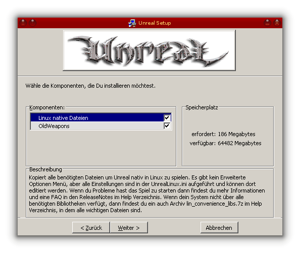

Unreal
======

.. |date| date::

.. sidebar:: Info

  .. image:: ../images/logo-freebsd.png

Dieses HowTo beschreibt die Installation und Einrichtung von Unreal. Hier geht
es nicht um "Unreal Gold" oder die Erweiterung "Return to Na Pali".
Die Installation geschieht aktuell auf einem FreeBSD 12.2-RELEASE. Ältere Releases
haben Probleme bei der Audio Wiedergabe.

Vorraussetzungen
----------------

-  Eine Unreal Installations CD.
-  Den UnrealClassicPatch227i von
   `hier <http://www.oldunreal.com/oldunrealpatches.html>`__.
-  Den UnrealPatch226Final von
   `hier <http://www.oldunreal.com/officialpatches.html>`__

Benötigte Pakete
----------------

Folgende Pakete werden zur Installation bzw. zum Spielen benötigt:

-  `emulators/linux_base-c7 <https://www.freshports.org/emulators/linux_base-c7/>`__
-  `x11/linux-c7-xorg-libs <https://www.freshports.org/x11/linux-c7-xorg-libs/>`__
-  `graphics/linux-c7-dri <https://www.freshports.org/graphics/linux-c7-dri/>`__
-  `audio/linux-c7-alsa-lib <https://www.freshports.org/audio/linux-c7-alsa-lib/>`__
-  `audio/alsa-plugins-oss <https://www.freshports.org/audio/linux-c7-alsa-plugins-oss/>`__

   Benutzer von NVIDIA Hardware benötigen auch noch:
-  `x11/linux-nvidia-libs <https://www.freshports.org/x11/linux-nvidia-libs/>`__

   auf amd64 Systemen:
-  `emulators/i386-wine <https://www.freshports.org/emulators/i386-wine/>`__ Nur zur installation des Spiels und der Patches.

   auf i386 Systemen:
-  `emulators/wine <https://www.freshports.org/emulators/wine/>`__ Nur zur Installation des Spiels und der Patches.

   Ein Programm zum dearchivieren der Patches:
-  `archivers/p7zip <https://www.freshports.org/archivers/p7zip/>`__ oder
-  `archivers/unzip <https://www.freshports.org/archivers/unzip/>`__ oder
-  `archivers/unrar <https://www.freshports.org/archivers/unrar>`__

Die Linux hosts Datei bearbeiten
--------------------------------

Damit im Spiel das Speichern/Laden funktioniert müssen die IP Adresse
und der Hostname des Rechners in der Datei /compat/linux/etc/hosts
eingetragen werden.

::

    127.0.0.1       localhost localhost.localdomain localhost4 localhost4.localdomain4
    ::1             localhost localhost.localdomain localhost6 localhost6.localdomain6
    192.168.X.X     hostname  # <- IP Adresse und Hostname eintregen

Installation
------------

Es empfiehlt sich ein separates WINEPREFIX anzulegen welches am Ende wieder
einfach entfernt werden kann.

::

    % mkdir /PATH/TO/WINEPREFIX

Mit winecfg ein CD Laufwerk anlegen, das auf den Mountpunkt der Unreal
CD zeigt, da es für die Installation der Patches benötigt wird.

::

    % env WINEPREFIX=/PATH/TO/WINEPREFIX winecfg

|image1|

Unreal mit wine installieren.

::

   % env WINEPREFIX=/PATH/TO/WINEPREFIX wine /PATH/TO/CD/SETUP.EXE

Im Installer dann den Zielpfad eingeben. Wenn man das WINEPREFIX wieder löschen möchte muss
darauf geachtet werden, das das Installationsverzeichnis außerhalb liegt (z.B. Z:\\home\\user\\Unreal).
Dann im Fenster "Select Components" DirectX 5 und den UnrealEd abwählen. |image2|

Das Spiel Patchen
-----------------

Zuerst den offiziellen Patch 226Final installieren da der Patch 227i
mindestens den Patch 224 vorraussetzt.

::

   % env WINEPREFIX=/PATH/TO/WINEPREFIX wine /PATH/TO/PATCHES/UnrealPatch226Final.exe

Dann den Patch 227i

::

   % env WINEPREFIX=/PATH/TO/WINEPREFIX wine /PATH/TO/PATCHES/UnrealClassicPatch227i.exe

Und nicht vergessen den Haken bei "Linux native Dateien" zu setzen.
|image3|

Benötigte Libs kopieren
-----------------------

Im Installationsverzeichnis gibt es im Ordner "Help" die Datei
lin_convenience_libs.tar.bz2. Diese muss entpackt und die Dateien in das
Verzeichnis "System" verschoben werden.

::

   % cd /PATH/TO/UNREAL/Help
   % tar -xjf lin_convenience_libs.tar.bz2
   % cd lin_convenience_libs
   % mv * ../../System
   
Damit das Spiel mit linux_base-c7 funktioniert müssen einige der Dateien wieder
entfernt werden.

::

   % rm /PATH/TO/UNREAL/System/libgcc_s.so
   % rm /PATH/TO/UNREAL/System/libgcc_s.so.1
   % rm /PATH/TO/UNREAL/System/libstdc++.so
   % rm /PATH/TO/UNREAL/System/libstdc++.so.6
   % rm /PATH/TO/UNREAL/System/libstdc++.so.6.0.8
   % rm /PATH/TO/UNREAL/System/libXxf86dga.so
   % rm /PATH/TO/UNREAL/System/libXxf86dga.so.1
   % rm /PATH/TO/UNREAL/System/libXxf86dga.so.1.0.0

Binary ausführbar machen
------------------------

Die Datei UnrealLinux.bin hat bei mir zu Problemen mit der Maus geführt
weshalb ich das Spiel über UnrealXLinux.bin starte. Dazu muss diese noch
ausführbar gemacht werden.

::

   % chmod u+x /PATH/TO/UNREAL/UnrealXLinux.bin

Spiel starten
-------------

Nun kann das Spiel endlich gestartet werden:

::

   # cd /PATH/TO/UNREAL/System
   # ./UnrealXLinux.bin

verwandte Artikel
-----------------

Es empfiehlt sich zu diesem Thema auch folgenden Artikel gelesen zu
haben.

-  `FreeBSD - Spiele <hauptseite>`__

Links
-----

-  `Homepage von Old Unreal <http://www.oldunreal.com/index.html>`__

.. |image1| image:: images/unreal-winecfg.png
   :class: align-center
   :width: 200px
.. |image2| image:: images/unreal-select_components.png
   :class: align-center
   :width: 200px

* :ref:`genindex`

Zuletzt geändert: |date|

